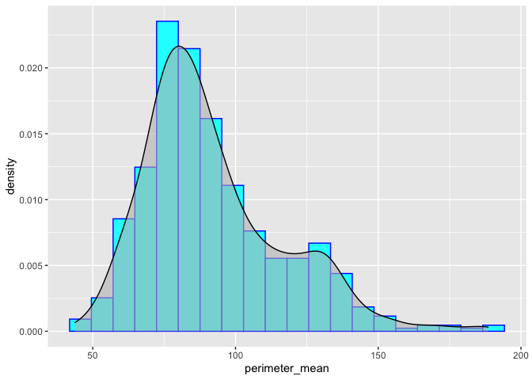
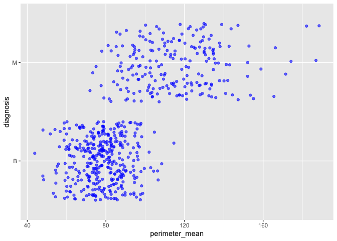
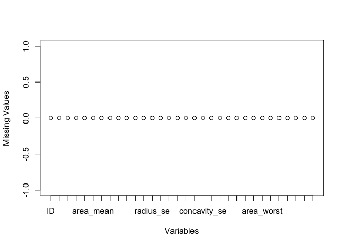
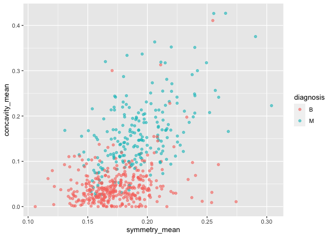
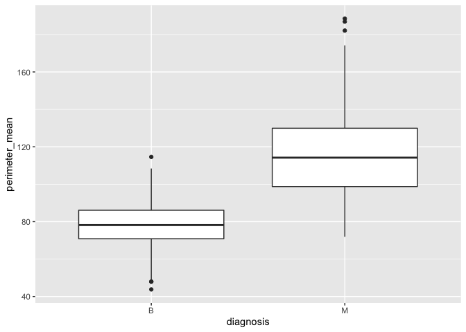
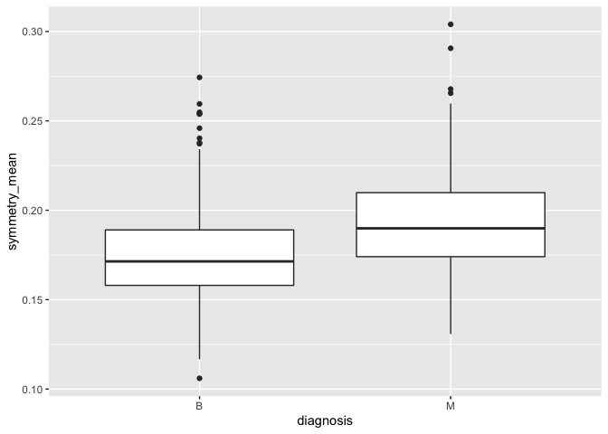

Mini Data-Analysis Milestone 1
================
Armaghan Sarvar

## Loading the the Necessary Packages

``` r
library(datateachr)  # provides 7 semi-tidy datasets
library(tidyverse)  # provides data analysis libraries
```

    ## ── Attaching packages ─────────────────────────────────────── tidyverse 1.3.1 ──

    ## ✓ ggplot2 3.3.5     ✓ purrr   0.3.4
    ## ✓ tibble  3.1.5     ✓ dplyr   1.0.7
    ## ✓ tidyr   1.1.4     ✓ stringr 1.4.0
    ## ✓ readr   2.0.2     ✓ forcats 0.5.1

    ## ── Conflicts ────────────────────────────────────────── tidyverse_conflicts() ──
    ## x dplyr::filter() masks stats::filter()
    ## x dplyr::lag()    masks stats::lag()

# Task 1: Choosing the favorite dataset

## 1.1 Choosing four datasets from the `datateachr` package

Here, the four datasets that I have chosen for analysis are listed and
briefly described.

1.  `cancer_sample`: Acquired courtesy of UCI Machine Learning
    Repository. It is reported to have 569 rows and 32 columns.
2.  `steam_games`: Acquired courtesy of Kaggle. It is reported to have
    40833 rows and 21 columns.
3.  `vancouver_trees`: Acquired courtesy of The City of Vancouver’s Open
    Data Portal. It is reported to have 146611 rows and 20 columns.
4.  `apt_buildings`: Acquired courtesy of The City of Toronto’s Open
    Data Portal. It is reported to have 3455 rows and 37 columns.

## 1.2 Dataset Exploration

In the following parts, the four chosen datasets will be explored. More
specifically, the `dplyr` package will be used to help us find out at
least 3 attributes about each dataset.

### Dataset 1

``` r
cancer_sample
```

    ## # A tibble: 569 × 32
    ##          ID diagnosis radius_mean texture_mean perimeter_mean area_mean
    ##       <dbl> <chr>           <dbl>        <dbl>          <dbl>     <dbl>
    ##  1   842302 M                18.0         10.4          123.      1001 
    ##  2   842517 M                20.6         17.8          133.      1326 
    ##  3 84300903 M                19.7         21.2          130       1203 
    ##  4 84348301 M                11.4         20.4           77.6      386.
    ##  5 84358402 M                20.3         14.3          135.      1297 
    ##  6   843786 M                12.4         15.7           82.6      477.
    ##  7   844359 M                18.2         20.0          120.      1040 
    ##  8 84458202 M                13.7         20.8           90.2      578.
    ##  9   844981 M                13           21.8           87.5      520.
    ## 10 84501001 M                12.5         24.0           84.0      476.
    ## # … with 559 more rows, and 26 more variables: smoothness_mean <dbl>,
    ## #   compactness_mean <dbl>, concavity_mean <dbl>, concave_points_mean <dbl>,
    ## #   symmetry_mean <dbl>, fractal_dimension_mean <dbl>, radius_se <dbl>,
    ## #   texture_se <dbl>, perimeter_se <dbl>, area_se <dbl>, smoothness_se <dbl>,
    ## #   compactness_se <dbl>, concavity_se <dbl>, concave_points_se <dbl>,
    ## #   symmetry_se <dbl>, fractal_dimension_se <dbl>, radius_worst <dbl>,
    ## #   texture_worst <dbl>, perimeter_worst <dbl>, area_worst <dbl>, …

-   Class Type

``` r
class(cancer_sample)
```

    ## [1] "spec_tbl_df" "tbl_df"      "tbl"         "data.frame"

-   Dimension of the dataset

``` r
dim(cancer_sample)
```

    ## [1] 569  32

-   Variables (features) of the dataset

``` r
names(cancer_sample)
```

    ##  [1] "ID"                      "diagnosis"              
    ##  [3] "radius_mean"             "texture_mean"           
    ##  [5] "perimeter_mean"          "area_mean"              
    ##  [7] "smoothness_mean"         "compactness_mean"       
    ##  [9] "concavity_mean"          "concave_points_mean"    
    ## [11] "symmetry_mean"           "fractal_dimension_mean" 
    ## [13] "radius_se"               "texture_se"             
    ## [15] "perimeter_se"            "area_se"                
    ## [17] "smoothness_se"           "compactness_se"         
    ## [19] "concavity_se"            "concave_points_se"      
    ## [21] "symmetry_se"             "fractal_dimension_se"   
    ## [23] "radius_worst"            "texture_worst"          
    ## [25] "perimeter_worst"         "area_worst"             
    ## [27] "smoothness_worst"        "compactness_worst"      
    ## [29] "concavity_worst"         "concave_points_worst"   
    ## [31] "symmetry_worst"          "fractal_dimension_worst"

-   Overall view of the data frame

``` r
summary(cancer_sample)
```

    ##        ID             diagnosis          radius_mean      texture_mean  
    ##  Min.   :     8670   Length:569         Min.   : 6.981   Min.   : 9.71  
    ##  1st Qu.:   869218   Class :character   1st Qu.:11.700   1st Qu.:16.17  
    ##  Median :   906024   Mode  :character   Median :13.370   Median :18.84  
    ##  Mean   : 30371831                      Mean   :14.127   Mean   :19.29  
    ##  3rd Qu.:  8813129                      3rd Qu.:15.780   3rd Qu.:21.80  
    ##  Max.   :911320502                      Max.   :28.110   Max.   :39.28  
    ##  perimeter_mean     area_mean      smoothness_mean   compactness_mean 
    ##  Min.   : 43.79   Min.   : 143.5   Min.   :0.05263   Min.   :0.01938  
    ##  1st Qu.: 75.17   1st Qu.: 420.3   1st Qu.:0.08637   1st Qu.:0.06492  
    ##  Median : 86.24   Median : 551.1   Median :0.09587   Median :0.09263  
    ##  Mean   : 91.97   Mean   : 654.9   Mean   :0.09636   Mean   :0.10434  
    ##  3rd Qu.:104.10   3rd Qu.: 782.7   3rd Qu.:0.10530   3rd Qu.:0.13040  
    ##  Max.   :188.50   Max.   :2501.0   Max.   :0.16340   Max.   :0.34540  
    ##  concavity_mean    concave_points_mean symmetry_mean    fractal_dimension_mean
    ##  Min.   :0.00000   Min.   :0.00000     Min.   :0.1060   Min.   :0.04996       
    ##  1st Qu.:0.02956   1st Qu.:0.02031     1st Qu.:0.1619   1st Qu.:0.05770       
    ##  Median :0.06154   Median :0.03350     Median :0.1792   Median :0.06154       
    ##  Mean   :0.08880   Mean   :0.04892     Mean   :0.1812   Mean   :0.06280       
    ##  3rd Qu.:0.13070   3rd Qu.:0.07400     3rd Qu.:0.1957   3rd Qu.:0.06612       
    ##  Max.   :0.42680   Max.   :0.20120     Max.   :0.3040   Max.   :0.09744       
    ##    radius_se        texture_se      perimeter_se       area_se       
    ##  Min.   :0.1115   Min.   :0.3602   Min.   : 0.757   Min.   :  6.802  
    ##  1st Qu.:0.2324   1st Qu.:0.8339   1st Qu.: 1.606   1st Qu.: 17.850  
    ##  Median :0.3242   Median :1.1080   Median : 2.287   Median : 24.530  
    ##  Mean   :0.4052   Mean   :1.2169   Mean   : 2.866   Mean   : 40.337  
    ##  3rd Qu.:0.4789   3rd Qu.:1.4740   3rd Qu.: 3.357   3rd Qu.: 45.190  
    ##  Max.   :2.8730   Max.   :4.8850   Max.   :21.980   Max.   :542.200  
    ##  smoothness_se      compactness_se      concavity_se     concave_points_se 
    ##  Min.   :0.001713   Min.   :0.002252   Min.   :0.00000   Min.   :0.000000  
    ##  1st Qu.:0.005169   1st Qu.:0.013080   1st Qu.:0.01509   1st Qu.:0.007638  
    ##  Median :0.006380   Median :0.020450   Median :0.02589   Median :0.010930  
    ##  Mean   :0.007041   Mean   :0.025478   Mean   :0.03189   Mean   :0.011796  
    ##  3rd Qu.:0.008146   3rd Qu.:0.032450   3rd Qu.:0.04205   3rd Qu.:0.014710  
    ##  Max.   :0.031130   Max.   :0.135400   Max.   :0.39600   Max.   :0.052790  
    ##   symmetry_se       fractal_dimension_se  radius_worst   texture_worst  
    ##  Min.   :0.007882   Min.   :0.0008948    Min.   : 7.93   Min.   :12.02  
    ##  1st Qu.:0.015160   1st Qu.:0.0022480    1st Qu.:13.01   1st Qu.:21.08  
    ##  Median :0.018730   Median :0.0031870    Median :14.97   Median :25.41  
    ##  Mean   :0.020542   Mean   :0.0037949    Mean   :16.27   Mean   :25.68  
    ##  3rd Qu.:0.023480   3rd Qu.:0.0045580    3rd Qu.:18.79   3rd Qu.:29.72  
    ##  Max.   :0.078950   Max.   :0.0298400    Max.   :36.04   Max.   :49.54  
    ##  perimeter_worst    area_worst     smoothness_worst  compactness_worst
    ##  Min.   : 50.41   Min.   : 185.2   Min.   :0.07117   Min.   :0.02729  
    ##  1st Qu.: 84.11   1st Qu.: 515.3   1st Qu.:0.11660   1st Qu.:0.14720  
    ##  Median : 97.66   Median : 686.5   Median :0.13130   Median :0.21190  
    ##  Mean   :107.26   Mean   : 880.6   Mean   :0.13237   Mean   :0.25427  
    ##  3rd Qu.:125.40   3rd Qu.:1084.0   3rd Qu.:0.14600   3rd Qu.:0.33910  
    ##  Max.   :251.20   Max.   :4254.0   Max.   :0.22260   Max.   :1.05800  
    ##  concavity_worst  concave_points_worst symmetry_worst   fractal_dimension_worst
    ##  Min.   :0.0000   Min.   :0.00000      Min.   :0.1565   Min.   :0.05504        
    ##  1st Qu.:0.1145   1st Qu.:0.06493      1st Qu.:0.2504   1st Qu.:0.07146        
    ##  Median :0.2267   Median :0.09993      Median :0.2822   Median :0.08004        
    ##  Mean   :0.2722   Mean   :0.11461      Mean   :0.2901   Mean   :0.08395        
    ##  3rd Qu.:0.3829   3rd Qu.:0.16140      3rd Qu.:0.3179   3rd Qu.:0.09208        
    ##  Max.   :1.2520   Max.   :0.29100      Max.   :0.6638   Max.   :0.20750

-   Seeing the unique values in the “diagnosis” column

``` r
unique(cancer_sample$diagnosis)
```

    ## [1] "M" "B"

-   Counting the number of samples for each diagnosis result

``` r
cancer_sample %>%
  group_by(diagnosis) %>%
  summarize(n())
```

    ## # A tibble: 2 × 2
    ##   diagnosis `n()`
    ##   <chr>     <int>
    ## 1 B           357
    ## 2 M           212

### Dataset 2

``` r
steam_games
```

    ## # A tibble: 40,833 × 21
    ##       id url    types name  desc_snippet recent_reviews all_reviews release_date
    ##    <dbl> <chr>  <chr> <chr> <chr>        <chr>          <chr>       <chr>       
    ##  1     1 https… app   DOOM  Now include… Very Positive… Very Posit… May 12, 2016
    ##  2     2 https… app   PLAY… PLAYERUNKNO… Mixed,(6,214)… Mixed,(836… Dec 21, 2017
    ##  3     3 https… app   BATT… Take comman… Mixed,(166),-… Mostly Pos… Apr 24, 2018
    ##  4     4 https… app   DayZ  The post-so… Mixed,(932),-… Mixed,(167… Dec 13, 2018
    ##  5     5 https… app   EVE … EVE Online … Mixed,(287),-… Mostly Pos… May 6, 2003 
    ##  6     6 https… bund… Gran… Grand Theft… NaN            NaN         NaN         
    ##  7     7 https… app   Devi… The ultimat… Very Positive… Very Posit… Mar 7, 2019 
    ##  8     8 https… app   Huma… Human: Fall… Very Positive… Very Posit… Jul 22, 2016
    ##  9     9 https… app   They… They Are Bi… Very Positive… Very Posit… Dec 12, 2017
    ## 10    10 https… app   Warh… In a world … <NA>           Mixed,(904… May 31, 2019
    ## # … with 40,823 more rows, and 13 more variables: developer <chr>,
    ## #   publisher <chr>, popular_tags <chr>, game_details <chr>, languages <chr>,
    ## #   achievements <dbl>, genre <chr>, game_description <chr>,
    ## #   mature_content <chr>, minimum_requirements <chr>,
    ## #   recommended_requirements <chr>, original_price <dbl>, discount_price <dbl>

-   Class Type

``` r
class(steam_games)
```

    ## [1] "spec_tbl_df" "tbl_df"      "tbl"         "data.frame"

-   Dimension of the dataset

``` r
dim(steam_games)
```

    ## [1] 40833    21

-   Variables (features) of the dataset

``` r
names(steam_games)
```

    ##  [1] "id"                       "url"                     
    ##  [3] "types"                    "name"                    
    ##  [5] "desc_snippet"             "recent_reviews"          
    ##  [7] "all_reviews"              "release_date"            
    ##  [9] "developer"                "publisher"               
    ## [11] "popular_tags"             "game_details"            
    ## [13] "languages"                "achievements"            
    ## [15] "genre"                    "game_description"        
    ## [17] "mature_content"           "minimum_requirements"    
    ## [19] "recommended_requirements" "original_price"          
    ## [21] "discount_price"

-   Overall view of the data frame

``` r
summary(steam_games)
```

    ##        id            url               types               name          
    ##  Min.   :    1   Length:40833       Length:40833       Length:40833      
    ##  1st Qu.:10209   Class :character   Class :character   Class :character  
    ##  Median :20417   Mode  :character   Mode  :character   Mode  :character  
    ##  Mean   :20417                                                           
    ##  3rd Qu.:30625                                                           
    ##  Max.   :40833                                                           
    ##                                                                          
    ##  desc_snippet       recent_reviews     all_reviews        release_date      
    ##  Length:40833       Length:40833       Length:40833       Length:40833      
    ##  Class :character   Class :character   Class :character   Class :character  
    ##  Mode  :character   Mode  :character   Mode  :character   Mode  :character  
    ##                                                                             
    ##                                                                             
    ##                                                                             
    ##                                                                             
    ##   developer          publisher         popular_tags       game_details      
    ##  Length:40833       Length:40833       Length:40833       Length:40833      
    ##  Class :character   Class :character   Class :character   Class :character  
    ##  Mode  :character   Mode  :character   Mode  :character   Mode  :character  
    ##                                                                             
    ##                                                                             
    ##                                                                             
    ##                                                                             
    ##   languages          achievements        genre           game_description  
    ##  Length:40833       Min.   :   1.00   Length:40833       Length:40833      
    ##  Class :character   1st Qu.:  12.00   Class :character   Class :character  
    ##  Mode  :character   Median :  21.00   Mode  :character   Mode  :character  
    ##                     Mean   :  77.24                                        
    ##                     3rd Qu.:  38.00                                        
    ##                     Max.   :9821.00                                        
    ##                     NA's   :28639                                          
    ##  mature_content     minimum_requirements recommended_requirements
    ##  Length:40833       Length:40833         Length:40833            
    ##  Class :character   Class :character     Class :character        
    ##  Mode  :character   Mode  :character     Mode  :character        
    ##                                                                  
    ##                                                                  
    ##                                                                  
    ##                                                                  
    ##  original_price     discount_price  
    ##  Min.   :     0.0   Min.   :  0.00  
    ##  1st Qu.:     2.0   1st Qu.:  8.78  
    ##  Median :     5.0   Median : 19.98  
    ##  Mean   :    53.1   Mean   : 46.82  
    ##  3rd Qu.:    10.0   3rd Qu.: 43.92  
    ##  Max.   :730640.0   Max.   :962.60  
    ##  NA's   :5353       NA's   :26290

-   Seeing the unique values in the “types” column

``` r
unique(steam_games$types)
```

    ## [1] "app"    "bundle" "sub"    NA

-   Counting the number of samples for each type reported

``` r
steam_games %>%
  group_by(types) %>%
  summarize(n())
```

    ## # A tibble: 4 × 2
    ##   types  `n()`
    ##   <chr>  <int>
    ## 1 app    38021
    ## 2 bundle  2572
    ## 3 sub      238
    ## 4 <NA>       2

### Dataset 3

``` r
vancouver_trees
```

    ## # A tibble: 146,611 × 20
    ##    tree_id civic_number std_street    genus_name species_name cultivar_name  
    ##      <dbl>        <dbl> <chr>         <chr>      <chr>        <chr>          
    ##  1  149556          494 W 58TH AV     ULMUS      AMERICANA    BRANDON        
    ##  2  149563          450 W 58TH AV     ZELKOVA    SERRATA      <NA>           
    ##  3  149579         4994 WINDSOR ST    STYRAX     JAPONICA     <NA>           
    ##  4  149590          858 E 39TH AV     FRAXINUS   AMERICANA    AUTUMN APPLAUSE
    ##  5  149604         5032 WINDSOR ST    ACER       CAMPESTRE    <NA>           
    ##  6  149616          585 W 61ST AV     PYRUS      CALLERYANA   CHANTICLEER    
    ##  7  149617         4909 SHERBROOKE ST ACER       PLATANOIDES  COLUMNARE      
    ##  8  149618         4925 SHERBROOKE ST ACER       PLATANOIDES  COLUMNARE      
    ##  9  149619         4969 SHERBROOKE ST ACER       PLATANOIDES  COLUMNARE      
    ## 10  149625          720 E 39TH AV     FRAXINUS   AMERICANA    AUTUMN APPLAUSE
    ## # … with 146,601 more rows, and 14 more variables: common_name <chr>,
    ## #   assigned <chr>, root_barrier <chr>, plant_area <chr>,
    ## #   on_street_block <dbl>, on_street <chr>, neighbourhood_name <chr>,
    ## #   street_side_name <chr>, height_range_id <dbl>, diameter <dbl>, curb <chr>,
    ## #   date_planted <date>, longitude <dbl>, latitude <dbl>

-   Class Type

``` r
class(vancouver_trees)
```

    ## [1] "tbl_df"     "tbl"        "data.frame"

-   Dimension of the dataset

``` r
dim(vancouver_trees)
```

    ## [1] 146611     20

-   Variables (features) of the dataset

``` r
names(vancouver_trees)
```

    ##  [1] "tree_id"            "civic_number"       "std_street"        
    ##  [4] "genus_name"         "species_name"       "cultivar_name"     
    ##  [7] "common_name"        "assigned"           "root_barrier"      
    ## [10] "plant_area"         "on_street_block"    "on_street"         
    ## [13] "neighbourhood_name" "street_side_name"   "height_range_id"   
    ## [16] "diameter"           "curb"               "date_planted"      
    ## [19] "longitude"          "latitude"

-   Overall view of the data frame

``` r
summary(vancouver_trees)
```

    ##     tree_id        civic_number    std_street         genus_name       
    ##  Min.   :    12   Min.   :    0   Length:146611      Length:146611     
    ##  1st Qu.: 65464   1st Qu.: 1306   Class :character   Class :character  
    ##  Median :134903   Median : 2604   Mode  :character   Mode  :character  
    ##  Mean   :131892   Mean   : 2937                                        
    ##  3rd Qu.:194450   3rd Qu.: 4005                                        
    ##  Max.   :266203   Max.   :17888                                        
    ##                                                                        
    ##  species_name       cultivar_name      common_name          assigned        
    ##  Length:146611      Length:146611      Length:146611      Length:146611     
    ##  Class :character   Class :character   Class :character   Class :character  
    ##  Mode  :character   Mode  :character   Mode  :character   Mode  :character  
    ##                                                                             
    ##                                                                             
    ##                                                                             
    ##                                                                             
    ##  root_barrier        plant_area        on_street_block  on_street        
    ##  Length:146611      Length:146611      Min.   :   0    Length:146611     
    ##  Class :character   Class :character   1st Qu.:1300    Class :character  
    ##  Mode  :character   Mode  :character   Median :2600    Mode  :character  
    ##                                        Mean   :2909                      
    ##                                        3rd Qu.:4000                      
    ##                                        Max.   :9900                      
    ##                                                                          
    ##  neighbourhood_name street_side_name   height_range_id     diameter     
    ##  Length:146611      Length:146611      Min.   : 0.000   Min.   :  0.00  
    ##  Class :character   Class :character   1st Qu.: 1.000   1st Qu.:  3.50  
    ##  Mode  :character   Mode  :character   Median : 2.000   Median :  9.00  
    ##                                        Mean   : 2.627   Mean   : 11.49  
    ##                                        3rd Qu.: 4.000   3rd Qu.: 16.50  
    ##                                        Max.   :10.000   Max.   :435.00  
    ##                                                                         
    ##      curb            date_planted          longitude         latitude    
    ##  Length:146611      Min.   :1989-10-27   Min.   :-123.2   Min.   :49.20  
    ##  Class :character   1st Qu.:1998-02-23   1st Qu.:-123.1   1st Qu.:49.23  
    ##  Mode  :character   Median :2004-01-28   Median :-123.1   Median :49.25  
    ##                     Mean   :2004-04-07   Mean   :-123.1   Mean   :49.25  
    ##                     3rd Qu.:2010-03-02   3rd Qu.:-123.1   3rd Qu.:49.26  
    ##                     Max.   :2019-07-03   Max.   :-123.0   Max.   :49.29  
    ##                     NA's   :76548        NA's   :22771    NA's   :22771

-   Seeing the unique values in the “street_side_name” column

``` r
unique(vancouver_trees$street_side_name)
```

    ## [1] "EVEN"     "ODD"      "MED"      "PARK"     "BIKE MED" "GREENWAY"

-   Counting the number of samples for each street_side_name reported

``` r
vancouver_trees %>%
  group_by(street_side_name) %>%
  summarize(n())
```

    ## # A tibble: 6 × 2
    ##   street_side_name `n()`
    ##   <chr>            <int>
    ## 1 BIKE MED            38
    ## 2 EVEN             71753
    ## 3 GREENWAY             5
    ## 4 MED               3297
    ## 5 ODD              71374
    ## 6 PARK               144

### Dataset 4

``` r
apt_buildings
```

    ## # A tibble: 3,455 × 37
    ##       id air_conditioning amenities    balconies barrier_free_acc… bike_parking 
    ##    <dbl> <chr>            <chr>        <chr>     <chr>             <chr>        
    ##  1 10359 NONE             Outdoor rec… YES       YES               0 indoor par…
    ##  2 10360 NONE             Outdoor pool YES       NO                0 indoor par…
    ##  3 10361 NONE             <NA>         YES       NO                Not Available
    ##  4 10362 NONE             <NA>         YES       YES               Not Available
    ##  5 10363 NONE             <NA>         NO        NO                12 indoor pa…
    ##  6 10364 NONE             <NA>         NO        NO                Not Available
    ##  7 10365 NONE             <NA>         NO        YES               Not Available
    ##  8 10366 CENTRAL AIR      Indoor pool… YES       NO                Not Available
    ##  9 10367 NONE             <NA>         YES       YES               0 indoor par…
    ## 10 10368 NONE             Indoor recr… YES       YES               Not Available
    ## # … with 3,445 more rows, and 31 more variables: exterior_fire_escape <chr>,
    ## #   fire_alarm <chr>, garbage_chutes <chr>, heating_type <chr>, intercom <chr>,
    ## #   laundry_room <chr>, locker_or_storage_room <chr>, no_of_elevators <dbl>,
    ## #   parking_type <chr>, pets_allowed <chr>, prop_management_company_name <chr>,
    ## #   property_type <chr>, rsn <dbl>, separate_gas_meters <chr>,
    ## #   separate_hydro_meters <chr>, separate_water_meters <chr>,
    ## #   site_address <chr>, sprinkler_system <chr>, visitor_parking <chr>, …

-   Class Type

``` r
class(apt_buildings)
```

    ## [1] "tbl_df"     "tbl"        "data.frame"

-   Dimension of the dataset

``` r
dim(apt_buildings)
```

    ## [1] 3455   37

-   Variables (features) of the dataset

``` r
names(apt_buildings)
```

    ##  [1] "id"                               "air_conditioning"                
    ##  [3] "amenities"                        "balconies"                       
    ##  [5] "barrier_free_accessibilty_entr"   "bike_parking"                    
    ##  [7] "exterior_fire_escape"             "fire_alarm"                      
    ##  [9] "garbage_chutes"                   "heating_type"                    
    ## [11] "intercom"                         "laundry_room"                    
    ## [13] "locker_or_storage_room"           "no_of_elevators"                 
    ## [15] "parking_type"                     "pets_allowed"                    
    ## [17] "prop_management_company_name"     "property_type"                   
    ## [19] "rsn"                              "separate_gas_meters"             
    ## [21] "separate_hydro_meters"            "separate_water_meters"           
    ## [23] "site_address"                     "sprinkler_system"                
    ## [25] "visitor_parking"                  "ward"                            
    ## [27] "window_type"                      "year_built"                      
    ## [29] "year_registered"                  "no_of_storeys"                   
    ## [31] "emergency_power"                  "non-smoking_building"            
    ## [33] "no_of_units"                      "no_of_accessible_parking_spaces" 
    ## [35] "facilities_available"             "cooling_room"                    
    ## [37] "no_barrier_free_accessible_units"

-   Overall view of the data frame

``` r
summary(apt_buildings)
```

    ##        id        air_conditioning    amenities          balconies        
    ##  Min.   :10359   Length:3455        Length:3455        Length:3455       
    ##  1st Qu.:11222   Class :character   Class :character   Class :character  
    ##  Median :12086   Mode  :character   Mode  :character   Mode  :character  
    ##  Mean   :12086                                                           
    ##  3rd Qu.:12950                                                           
    ##  Max.   :13813                                                           
    ##                                                                          
    ##  barrier_free_accessibilty_entr bike_parking       exterior_fire_escape
    ##  Length:3455                    Length:3455        Length:3455         
    ##  Class :character               Class :character   Class :character    
    ##  Mode  :character               Mode  :character   Mode  :character    
    ##                                                                        
    ##                                                                        
    ##                                                                        
    ##                                                                        
    ##   fire_alarm        garbage_chutes     heating_type         intercom        
    ##  Length:3455        Length:3455        Length:3455        Length:3455       
    ##  Class :character   Class :character   Class :character   Class :character  
    ##  Mode  :character   Mode  :character   Mode  :character   Mode  :character  
    ##                                                                             
    ##                                                                             
    ##                                                                             
    ##                                                                             
    ##  laundry_room       locker_or_storage_room no_of_elevators  parking_type      
    ##  Length:3455        Length:3455            Min.   : 0.000   Length:3455       
    ##  Class :character   Class :character       1st Qu.: 0.000   Class :character  
    ##  Mode  :character   Mode  :character       Median : 1.000   Mode  :character  
    ##                                            Mean   : 1.208                     
    ##                                            3rd Qu.: 2.000                     
    ##                                            Max.   :32.000                     
    ##                                            NA's   :5                          
    ##  pets_allowed       prop_management_company_name property_type     
    ##  Length:3455        Length:3455                  Length:3455       
    ##  Class :character   Class :character             Class :character  
    ##  Mode  :character   Mode  :character             Mode  :character  
    ##                                                                    
    ##                                                                    
    ##                                                                    
    ##                                                                    
    ##       rsn          separate_gas_meters separate_hydro_meters
    ##  Min.   :4152554   Length:3455         Length:3455          
    ##  1st Qu.:4153682   Class :character    Class :character     
    ##  Median :4154598   Mode  :character    Mode  :character     
    ##  Mean   :4167867                                            
    ##  3rd Qu.:4155538                                            
    ##  Max.   :4716349                                            
    ##                                                             
    ##  separate_water_meters site_address       sprinkler_system   visitor_parking   
    ##  Length:3455           Length:3455        Length:3455        Length:3455       
    ##  Class :character      Class :character   Class :character   Class :character  
    ##  Mode  :character      Mode  :character   Mode  :character   Mode  :character  
    ##                                                                                
    ##                                                                                
    ##                                                                                
    ##                                                                                
    ##      ward           window_type          year_built   year_registered
    ##  Length:3455        Length:3455        Min.   :1805   Min.   :2017   
    ##  Class :character   Class :character   1st Qu.:1955   1st Qu.:2017   
    ##  Mode  :character   Mode  :character   Median :1962   Median :2017   
    ##                                        Mean   :1962   Mean   :2017   
    ##                                        3rd Qu.:1970   3rd Qu.:2017   
    ##                                        Max.   :2019   Max.   :2020   
    ##                                        NA's   :13     NA's   :89     
    ##  no_of_storeys    emergency_power    non-smoking_building  no_of_units     
    ##  Min.   : 0.000   Length:3455        Length:3455          Min.   :   0.00  
    ##  1st Qu.: 3.000   Class :character   Class :character     1st Qu.:  25.00  
    ##  Median : 5.000   Mode  :character   Mode  :character     Median :  52.00  
    ##  Mean   : 7.738                                           Mean   :  91.09  
    ##  3rd Qu.:10.000                                           3rd Qu.: 124.00  
    ##  Max.   :51.000                                           Max.   :4111.00  
    ##                                                                            
    ##  no_of_accessible_parking_spaces facilities_available cooling_room      
    ##  Min.   :  0.000                 Length:3455          Length:3455       
    ##  1st Qu.:  0.000                 Class :character     Class :character  
    ##  Median :  1.000                 Mode  :character     Mode  :character  
    ##  Mean   :  6.559                                                        
    ##  3rd Qu.:  5.000                                                        
    ##  Max.   :340.000                                                        
    ##  NA's   :123                                                            
    ##  no_barrier_free_accessible_units
    ##  Min.   :  0.000                 
    ##  1st Qu.:  0.000                 
    ##  Median :  0.000                 
    ##  Mean   :  9.408                 
    ##  3rd Qu.:  1.000                 
    ##  Max.   :474.000                 
    ##  NA's   :154

-   Seeing the unique values in the “heating_type” column

``` r
unique(apt_buildings$heating_type)
```

    ## [1] "HOT WATER"      "ELECTRIC"       "FORCED AIR GAS" NA

-   Counting the number of samples for each heating_type reported

``` r
apt_buildings %>%
  group_by(heating_type) %>%
  summarize(n())
```

    ## # A tibble: 4 × 2
    ##   heating_type   `n()`
    ##   <chr>          <int>
    ## 1 ELECTRIC         265
    ## 2 FORCED AIR GAS   315
    ## 3 HOT WATER       2789
    ## 4 <NA>              86

## 1.3 Narrowing down top 2 datasets

Based on the exploration done in the previous part (section 1.2), I find
`cancer_sample` and `steam_games` most fascinating ones.

-   `cancer_samples`:

1.  First of all, I find the application and usage of this dataset in
    healthcare highly interesting and important. By analyzing this
    dataset, we can predict whether a possible detected tumour is
    malignant or benign based on its features.
2.  As the code is shown in the previous section, the number of samples
    for each diagnosis result (357 and 212) are close to each other,
    which says we have a balanced dataset.
3.  We do not have any NaN values in the diagnosis column.
4.  Many quantitative values are present in the dataset which makes
    statistical analysis in terms of relation between different values
    more meaningful.

-   `steam_games`:

1.  In this dataset, features and their values are human-readable and no
    expertise is needed for understanding them.
2.  The application of marketing analysis that can be performed on it is
    highly interesting.
3.  As the code is shown in the previous section, the number of samples
    for each of the “app” and “bundle” type values is high enough which
    can help us analyze the differences between the two, for example
    based on the reviews recorded.  
4.  Dataset has a “recent_reviews” column, which enables many research
    questions about the data. In the following, the possible analysis is
    shown:

``` r
nrow(steam_games %>%
  filter(str_detect(recent_reviews, "Positive")))
```

    ## [1] 1974

``` r
nrow(steam_games %>%
  filter(str_detect(recent_reviews, "Negative")))
```

    ## [1] 90

``` r
nrow(steam_games %>%
  filter(str_detect(recent_reviews, "Mixed")))
```

    ## [1] 642

## 1.4 Choosing the final dataset

My final choice in dataset selection would be `cancer_sample`. A
possible research question I’m interested in answering is:

*How can we diagnose cancer having different quantitative variables and
characteristics of images from breast tumors?*

# Task 2: Exploring the chosen dataset

## 2.1

In this section, 4 exercises will be conducted to help me dive deeper
into the data. These exercises are listed below:

1.  Plotting the histogram of the numeric variable “perimeter_mean”:

``` r
cancer_sample %>%
  ggplot(aes(x=perimeter_mean)) + 
  geom_histogram(aes(y=..density..), bins=20, colour="blue", fill="cyan") + geom_density(fill="grey", alpha=0.6)
```

<!-- --> As
we can in the above plot, the frequencies of the “perimeter_mean” column
values form a left-skewed curve.

``` r
ggplot(cancer_sample) +
    geom_jitter(aes(x = perimeter_mean, y = diagnosis), colour="blue", alpha = 0.6)
```

<!-- --> As
shown in the above plot, we can have a general separation of Benign and
Malignant diagnosis values based on the values of the “perimeter_mean”
feature. As perimeter_mean increases, more samples are Malignant.

2.  Investigating how many missing values there are per variable. (And
    finding a way to plot this!)

``` r
cancer_sample %>%
  select(everything()) %>%  
  summarise_all(funs(sum(is.na(.))))
```

    ## Warning: `funs()` was deprecated in dplyr 0.8.0.
    ## Please use a list of either functions or lambdas: 
    ## 
    ##   # Simple named list: 
    ##   list(mean = mean, median = median)
    ## 
    ##   # Auto named with `tibble::lst()`: 
    ##   tibble::lst(mean, median)
    ## 
    ##   # Using lambdas
    ##   list(~ mean(., trim = .2), ~ median(., na.rm = TRUE))
    ## This warning is displayed once every 8 hours.
    ## Call `lifecycle::last_lifecycle_warnings()` to see where this warning was generated.

    ## # A tibble: 1 × 32
    ##      ID diagnosis radius_mean texture_mean perimeter_mean area_mean
    ##   <int>     <int>       <int>        <int>          <int>     <int>
    ## 1     0         0           0            0              0         0
    ## # … with 26 more variables: smoothness_mean <int>, compactness_mean <int>,
    ## #   concavity_mean <int>, concave_points_mean <int>, symmetry_mean <int>,
    ## #   fractal_dimension_mean <int>, radius_se <int>, texture_se <int>,
    ## #   perimeter_se <int>, area_se <int>, smoothness_se <int>,
    ## #   compactness_se <int>, concavity_se <int>, concave_points_se <int>,
    ## #   symmetry_se <int>, fractal_dimension_se <int>, radius_worst <int>,
    ## #   texture_worst <int>, perimeter_worst <int>, area_worst <int>, …

As it can be seen, there are no missing values in this dataset at all.
Plotting the above calculation:

``` r
my_res <- (cancer_sample %>% 
  summarise_all(funs(sum(is.na(.))))) 
 
null_counts <- c(my_res) 
 
plot(1:length(null_counts), null_counts, xaxt = "n", xlab='Variables', ylab='Missing Values', type = 'p') 
axis(1, at=1:length(null_counts), labels=names(cancer_sample))
```

<!-- -->

3.  Exploring the relationship between 2 variables in a plot.

``` r
cancer_sample %>% 
  ggplot(aes(symmetry_mean, concavity_mean, color = diagnosis)) +
  geom_point(alpha = 0.6)
```

<!-- --> In
the above scatter plot, the relationship between symmetry and concavity
of the cell nuclei is represented. the samples are differentiated based
on Malignant vs. Benign diagnosis values.

4.  Using a boxplot to look at the frequency of different observations
    within two variables.

``` r
ggplot(cancer_sample, aes(x = diagnosis, y = perimeter_mean)) +
  geom_boxplot()
```

<!-- -->

``` r
ggplot(cancer_sample, aes(x = diagnosis, y = symmetry_mean)) +
  geom_boxplot()
```

<!-- --> As
shown in the above box plot, we can see the distribution of each of the
“perimeter_mean” and “symmetry_mean” features based on the observation
of samples being Malignant or Benign. This helps us compare how the
different feature values and their data percentiles and averages are
regarding the diagnosis.

## 2.2 Explanation of the chosen exercises

-   Exercise 1:

1.  It makes sense to look at the distribution of any of the columns
    provided in the dataset. This is because we want to see the shape of
    the distribution, especially when determining whether the output of
    a process is distributed approximately normally.
2.  Each numeric variable has an effect on the `diagnosis` outcome, and
    we can compare the scatter plot of the feature values across the
    values of the diagnosis column.

-   Exercise 2: It is important to check for missing values in a
    dataset, since the existence of these values can negatively effect
    both statistical analysis and future model building on the data. I
    was able to make sure that fortunately, there was no unrecorded
    value in the `cancer_sample` dataset.

-   Exercise 3: I decided to do this exercise because I believe
    exploring the relationship between 2 variables helps us measure the
    strength of the positive/negative relationship between two features
    and compute their association. A high correlation points to a strong
    relationship between the two variables, while a low correlation
    means that the variables are weakly related. In the extracted plot
    we gained an idea of this relationship regarding the diagnosis
    binary values.

-   Exercise 4: I decided to look at the frequencies of variables by
    using a boxplot because I believe a box plot is easy to read, it can
    summarize data regarding different observations and display the
    results in a single graph. Since the boxplot is a standardized way
    of displaying the distribution of data based on minimum, first
    quartile, median, third quartile, and maximum, it tells us about the
    outliers and also allows for comparison of data for more effective
    decision-making.

# Task 3: Research Questions

1.  Can we predict a diagnosis as malignant or benign based on the
    provided features from nuclei images?
2.  How is the distribution of each feature value considering the
    samples being malignant or benign?
3.  What are the statistical measurements of two features when compared
    to each other among malignant and benign diagnoses? For example,
    what are the values of the mean, median and standard deviation of
    concavity_mean vs. symmetry_mean among malignant diagnoses?
4.  Which features have a more significant effect on the samples being
    classified as malignant or benign? In other words, which columns can
    we omit and still have a deterministic diagnosis prediction on input
    samples and which columns play an important role in separating the
    data values?
