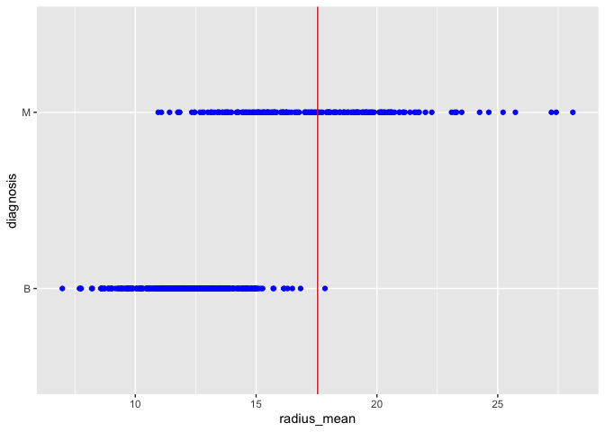
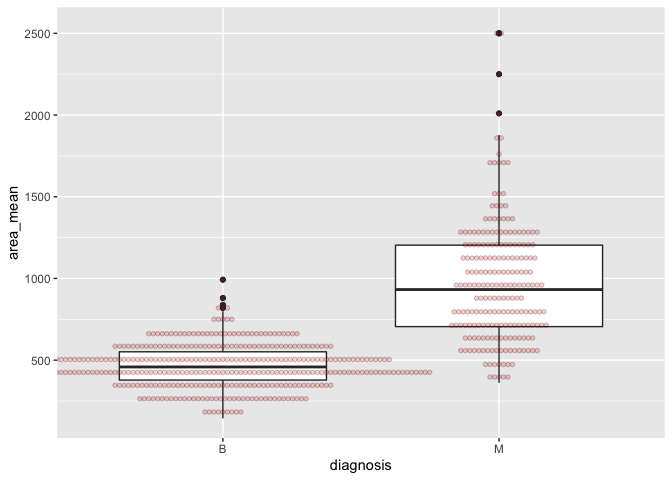
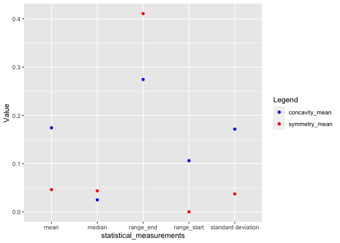
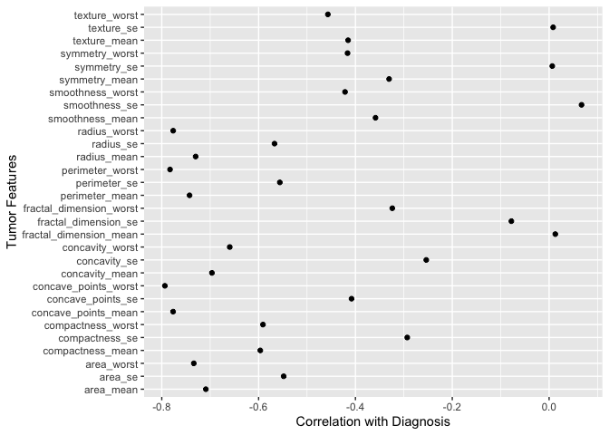
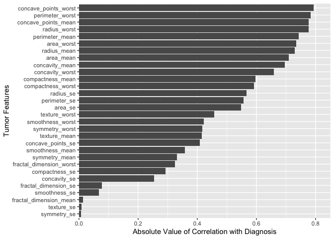

Data_Analysis
================
Armaghan Sarvar

## Loading the the Necessary Packages

``` r
library(datateachr)  # provides 7 semi-tidy datasets
library(tidyverse)  # provides data analysis libraries
```

    ## ── Attaching packages ─────────────────────────────────────── tidyverse 1.3.1 ──

    ## ✓ ggplot2 3.3.5     ✓ purrr   0.3.4
    ## ✓ tibble  3.1.5     ✓ dplyr   1.0.7
    ## ✓ tidyr   1.1.4     ✓ stringr 1.4.0
    ## ✓ readr   2.0.2     ✓ forcats 0.5.1

    ## ── Conflicts ────────────────────────────────────────── tidyverse_conflicts() ──
    ## x dplyr::filter() masks stats::filter()
    ## x dplyr::lag()    masks stats::lag()

# Task 1: Process and summarize the data

## 1.1 The four research questions defined in milestone 1

1.  Can we predict a diagnosis as malignant or benign based on the
    provided features from nuclei images?
2.  How is the distribution of each feature value considering the
    samples being malignant or benign?
3.  What are the statistical measurements of two features when compared
    to each other among malignant and benign diagnoses? For example,
    what are the values of the mean, median and standard deviation of
    concavity_mean vs. symmetry_mean among malignant diagnoses?
4.  Which features have a more significant effect on the samples being
    classified as malignant or benign? In other words, which columns can
    we omit and still have a deterministic diagnosis prediction on input
    samples and which columns play an important role in separating the
    data values?

## 1.2

*Research question 1, Summarizing:*

Let’s look at the data again.

``` r
cancer_sample
```

    ## # A tibble: 569 × 32
    ##          ID diagnosis radius_mean texture_mean perimeter_mean area_mean
    ##       <dbl> <chr>           <dbl>        <dbl>          <dbl>     <dbl>
    ##  1   842302 M                18.0         10.4          123.      1001 
    ##  2   842517 M                20.6         17.8          133.      1326 
    ##  3 84300903 M                19.7         21.2          130       1203 
    ##  4 84348301 M                11.4         20.4           77.6      386.
    ##  5 84358402 M                20.3         14.3          135.      1297 
    ##  6   843786 M                12.4         15.7           82.6      477.
    ##  7   844359 M                18.2         20.0          120.      1040 
    ##  8 84458202 M                13.7         20.8           90.2      578.
    ##  9   844981 M                13           21.8           87.5      520.
    ## 10 84501001 M                12.5         24.0           84.0      476.
    ## # … with 559 more rows, and 26 more variables: smoothness_mean <dbl>,
    ## #   compactness_mean <dbl>, concavity_mean <dbl>, concave_points_mean <dbl>,
    ## #   symmetry_mean <dbl>, fractal_dimension_mean <dbl>, radius_se <dbl>,
    ## #   texture_se <dbl>, perimeter_se <dbl>, area_se <dbl>, smoothness_se <dbl>,
    ## #   compactness_se <dbl>, concavity_se <dbl>, concave_points_se <dbl>,
    ## #   symmetry_se <dbl>, fractal_dimension_se <dbl>, radius_worst <dbl>,
    ## #   texture_worst <dbl>, perimeter_worst <dbl>, area_worst <dbl>, …

**Computing the number of observations for the categorical variable
“diagnosis”.**

``` r
cancer_sample %>%
  group_by(diagnosis) %>%
  summarize(n())
```

    ## # A tibble: 2 × 2
    ##   diagnosis `n()`
    ##   <chr>     <int>
    ## 1 B           357
    ## 2 M           212

Explanation: As the code is shown in the above, the number of samples
for each diagnosis result are close to each other, which says we have a
balanced dataset. This helps us be able to answer the first question
without having to change our data and by checking the feature values for
each the diagnosis outputs. To be more specific, no data generation or
aggregation would be needed if we wanted to build a statistical model
which tries to predict the diagnosis values for input samples, since the
amount of data in each category is neither insufficient nor too much.

**Computing the number of observations for the categorical variable
“diagnosis” (here, based on the “radius_mean” values).**

``` r
threshold = sum(range(cancer_sample["radius_mean"]))/2
cancer_sample %>%
  group_by(radius_mean > threshold, diagnosis) %>%
  summarize(n())
```

    ## `summarise()` has grouped output by 'radius_mean > threshold'. You can override using the `.groups` argument.

    ## # A tibble: 4 × 3
    ## # Groups:   radius_mean > threshold [2]
    ##   `radius_mean > threshold` diagnosis `n()`
    ##   <lgl>                     <chr>     <int>
    ## 1 FALSE                     B           356
    ## 2 FALSE                     M           111
    ## 3 TRUE                      B             1
    ## 4 TRUE                      M           101

Explanation: The above task helps us answer the first research question.
This is because as we can see, by counting the number of samples per
diagnosis output based on the threshold we set for `radius_mean`, we can
conclude that in the cases where `radius_mean` is bigger than our
threshold, almost all records are Malignant. Generalizing this result
and calculating it for other features can help us build a more
complicated cancer diagnosis system.

*Research question 1, Graphing:*

**Create a graph out of summarized variables that has at least two geom
layers.**

``` r
cancer_sample %>%
  ggplot(aes(x=radius_mean, y=diagnosis)) +
  geom_point(color="blue") +
  geom_vline(xintercept=threshold, 
                color = "red", size=0.5)
```

<!-- -->  

Explanation: As we can see in the above plot, we have been able to gain
a better insight on the results we got from the Summarizing section.
Also, we can detect some of the outliers (here, based on the
“radius_mean” feature) that exist in each category of “malignant” or
“benign”.

*Research question 2, Summarizing:*

**Computing the range, mean, standard deviation and median of the
“area_mean” variable across the groups of the “diagnosis” variable from
the data.**

``` r
cancer_sample %>%
  group_by(diagnosis) %>%
  summarize(range(area_mean)[1], range(area_mean)[2], mean(area_mean), median(area_mean), sd(area_mean))
```

    ## # A tibble: 2 × 6
    ##   diagnosis `range(area_mean… `range(area_mea… `mean(area_mean… `median(area_me…
    ##   <chr>                 <dbl>            <dbl>            <dbl>            <dbl>
    ## 1 B                      144.             992.             463.             458.
    ## 2 M                      362.            2501              978.             932 
    ## # … with 1 more variable: sd(area_mean) <dbl>

Explanation: As we can see in the above computation, having the range,
mean, standard deviation and median results will help us successfully
obtain the distribution of the “area_mean” feature values considering
the samples being malignant or benign.

*Research question 2, Graphing:*

**Creating a graph out of summarized variables that has at least two
geom layers**

``` r
cancer_sample %>%
  ggplot(aes(x=diagnosis, y=area_mean)) +
  geom_boxplot() +
  geom_dotplot(binaxis='y', 
               stackdir='center', 
               dotsize = .35, 
               fill="red", alpha=0.2)
```

    ## Bin width defaults to 1/30 of the range of the data. Pick better value with `binwidth`.

<!-- -->  

Explanation: As seen in the above figure, the boxplots can give us
information about the distribution of the “area_mean” variable by
visualizing five summary statistics the median, two hinges and two
whiskers, and all “outlying” points individually. On top of the box
plot, the dot plot can provide more clear information in the form of
summary statistics by each group. The dots are staggered such that each
dot represents one observation.

*Research question 3, Summarizing:* **Computing the range, mean,
standard deviation and median of the “concavity_mean” variable across
the groups of the “diagnosis” variable from the data.**

``` r
q1.2 <- (cancer_sample %>%
  group_by(diagnosis) %>%
  summarize(range(concavity_mean)[1], range(concavity_mean)[2], mean(concavity_mean), median(concavity_mean), sd(concavity_mean)))

q1.2
```

    ## # A tibble: 2 × 6
    ##   diagnosis `range(concavity… `range(concavit… `mean(concavity… `median(concavi…
    ##   <chr>                 <dbl>            <dbl>            <dbl>            <dbl>
    ## 1 B                    0                 0.411           0.0461           0.0371
    ## 2 M                    0.0240            0.427           0.161            0.151 
    ## # … with 1 more variable: sd(concavity_mean) <dbl>

Now, in order to answer the research question number 3, we only need to
do the above computation for the “symmetry_mean” variable too. Also, we
need to filter the diagnosis values as follows:

``` r
filtered <- (cancer_sample %>%
  group_by(diagnosis) %>%
  summarize(range(concavity_mean)[1], range(concavity_mean)[2], mean(concavity_mean), median(concavity_mean), sd(concavity_mean),
            range(symmetry_mean)[1], range(symmetry_mean)[2], mean(symmetry_mean), median(symmetry_mean), sd(symmetry_mean)) %>%
  filter(diagnosis == "B"))
filtered
```

    ## # A tibble: 1 × 11
    ##   diagnosis `range(concavity… `range(concavit… `mean(concavity… `median(concavi…
    ##   <chr>                 <dbl>            <dbl>            <dbl>            <dbl>
    ## 1 B                         0            0.411           0.0461           0.0371
    ## # … with 6 more variables: sd(concavity_mean) <dbl>,
    ## #   range(symmetry_mean)[1] <dbl>, range(symmetry_mean)[2] <dbl>,
    ## #   mean(symmetry_mean) <dbl>, median(symmetry_mean) <dbl>,
    ## #   sd(symmetry_mean) <dbl>

Explanation: As seen above, this Summarizing question can easily help us
in answering the third research question. Especially by adding some
minor modifications.

*Research question 3, Graphing:*

**Creating a graph out of summarized variables that has at least two
geom layers**

``` r
statistical_measurements = c("range_start", "range_end", "mean", "standard deviation", "median")
concavity = c(as.numeric(unlist(filtered[2:6])))
symmetry = c(as.numeric(unlist(filtered[7:11])))
df = data.frame(statistical_measurements, concavity, symmetry)
ggplot(df) +
      geom_point(aes(x=statistical_measurements, y=concavity, color='red')) +
      geom_point(aes(x=statistical_measurements, y=symmetry, color='blue')) +
      labs(color='Legend') +
      scale_color_manual(labels = c("concavity_mean", "symmetry_mean"), values = c("blue", "red")) +
      ylab("Value")
```

<!-- -->

  

Explanation: As it has been depicted in the above plot, this graph shows
the detailed information needed for answering research question 3. More
specifically, the `range_start`, `range_end`, `mean`,
`standard deviation`, `median` which are some of the important
statistical measurements are compared to each other for the
`concavity_mean` and `symmetry_mean` features, considering benign
diagnosis. The same comparison can be shown for malignant samples too,
which, gives us the same deeper insight into how some of the
measurements are different for the features, when we only look at one
possible prediction outcome among our samples.

*Research question 4, Summarizing:*

As stated in the *Note* section of the instructions for this assignment,
it’s possible that we might find the instructions too rigid for the data
set. In this case, we can deviate from the instructions.

**Computing the correlation between the columns of the `cancer_sample`
dataset (except IDs) with the `diagnosis` feature.**

``` r
correlations <- c(1: 29)

for (i in 3: ncol(cancer_sample)){
  correlations[i - 2] <- ltm::biserial.cor(unlist(cancer_sample[,i]), cancer_sample$diagnosis)
}
correlations
```

    ##  [1] -0.730028511 -0.415185300 -0.742635530 -0.708983837 -0.358559965
    ##  [6] -0.596533678 -0.696359707 -0.776613840 -0.330498554  0.012837603
    ## [11] -0.567133821  0.008303333 -0.556140703 -0.548235940  0.067016011
    ## [16] -0.292999244 -0.253729766 -0.408042333  0.006521756 -0.077972417
    ## [21] -0.776453779 -0.456902821 -0.782914137 -0.733825035 -0.421464861
    ## [26] -0.590998238 -0.659610210 -0.793566017 -0.416294311 -0.323872189

Explanation: For research question 4, we want to figure out which
features have a more significant effect on the samples being classified
as malignant or benign. To understand which columns we can omit and
still have a deterministic diagnosis prediction on input samples, one
way would be to calculate the correlation values between each of the
columns and the diagnosis prediction column. Correlation is a powerful
tool to identify patterns in the given data and describe associations,
as it is a measure of the extent to which two variables are related.
Another important thing to note about correlation is that it does not
make a statement about cause and effect. Which is not we are looking for
right now. Hence, it makes sense to calculate this metric in order to
answer the research question.

*Research question 4, Graphing:*

**Creating a graph out of summarized variables that has at least two
geom layers**

``` r
features <- names(cancer_sample)[3: 32]
values <- (correlations)

df <- data.frame(features, values)

df %>%
  ggplot(aes(x=values, y=features)) +
  geom_point() +
  xlab("Correlation with Diagnosis") +
  ylab("Tumor Features")
```

<!-- -->

``` r
df$values <- abs(df$values)

df %>%
  ggplot(aes(x=values, y=reorder(features, values))) +
  geom_bar(stat="identity") +
  xlab("Absolute Value of Correlation with Diagnosis") +
  ylab("Tumor Features") +
  scale_x_continuous(expand = c(0, 0), limits = c(0, 0.85))
```

<!-- -->

  
Explanation: The above plots show the information we extracted from the
data in the last summarizing section. Here, we are able to more
specifically see which features (columns) in the dataset have a
higher/lower correlation with the labels column (diagnosis values).
These graphs provide of with the following information: 1) Most of the
features have a negative correlation with diagnosis, which means as they
increase, diagnosis decreases, and vice versa. 2) The correlations that
are closer to zero tell us that features do not have a strong positive
or negative association with diagnosis. For example, `Texture_se` or
`symmetry_se` are so. 3) The correlations that are far from 0 and closer
to -1, tell us that features have a strong negative association with
diagnosis. For example, the higher `perimeter_worst` and
`concave_points_worst` values, the lower benign diagnosis values. The
second graph shows the absolute value of the correlation of each feature
with the diagnosis.

## 1.3

-   Based on the operations, how much closer are we to answering the
    research questions? What aspects of the research questions remain
    unclear? Can the research questions be refined? Which research
    questions yield interesting results?

I believe after the above analysis on data by both summarizing and
graphing techniques, we are much more closer to have deterministic
answers to the research questions.

1.  The first research question still has steps ahead; however, now we
    have more information about the data and whether different
    preprocessing steps are needed before we design the exact prediction
    system. For example, by computing the number of observations for the
    categorical variable “diagnosis”, we gain insight about what
    fraction of samples having a range of each feature fall into
    Malignant or Benign categories. The graphing part figure also took
    us one more step ahead by showing based on each feature, which
    samples exist in categories of diagnosis. Regarding the unclear
    aspects, the prediction system that can do the prediction with high
    accuracy and can also consider all the features at once has to be
    defined. As seen, even simple calculations can lead to interesting
    results regarding this question. I was amazed to see how
    thresholding on one feature could give us a decision metric for
    samples being benign or not. However, regarding refining the
    question, if the decision making could be restricted to only some of
    the features, we would answer this question more effectively.
2.  Using the summarizing and graphing techniques provided, we showed
    how the second research question can successfully be answered. Of
    course, the distribution of all feature values considering the
    samples being malignant or benign was not depicted, but right now we
    have the guideline of how to get to it by the statistical
    measurements we extracted. Hence, I believe this question does not
    have to be refined at all. Also, the results from the graphing part
    were really interesting since we now have an insight of how the
    distribution of the data regarding `area_mean` are different for
    malignant and benign samples.
3.  We were able to obtain a procedure for how to successfully answer
    the third research question. The above clarifications only need to
    be extended to other possible conditions (both malignant and benign
    categories and also, other numerical features). Hence, I do not
    think any changes are needed for this question. The interesting
    aspect of the question is that we are able to explore the possible
    characteristics of the malignant and benign category samples when
    they are looked at individually.
4.  This question has also been analyzed to some great extent. however,
    it definitely has room for further summarizing and graphing
    techniques. To be more specific, there might not be only one exact
    method by which this question can be answered. Maybe after having a
    final prediction model for question one, we will be able to test
    omitting different columns and check how the prediction result and
    accuracy changes. Hence, some change to this question can be to also
    explicitly state what method should be deployed for finding features
    that have a more significant effect on classification. Still, I find
    the correlation results really interesting as I was able to see
    which features change with the prediction, to what extent, and
    whether positively or negatively.

# Task 2: Tidy the data

## 2.1

We should identify if the data is tidy or untidy, by going through all
the columns, or if there are \> 8 variables, just pick 8, and explain
whether the data is untidy or tidy.

The number of columns:

``` r
ncol(cancer_sample)
```

    ## [1] 32

The number of columns is more than 8. picking 8 columns:

``` r
cancer_sample %>%
      select(1:8)
```

    ## # A tibble: 569 × 8
    ##          ID diagnosis radius_mean texture_mean perimeter_mean area_mean
    ##       <dbl> <chr>           <dbl>        <dbl>          <dbl>     <dbl>
    ##  1   842302 M                18.0         10.4          123.      1001 
    ##  2   842517 M                20.6         17.8          133.      1326 
    ##  3 84300903 M                19.7         21.2          130       1203 
    ##  4 84348301 M                11.4         20.4           77.6      386.
    ##  5 84358402 M                20.3         14.3          135.      1297 
    ##  6   843786 M                12.4         15.7           82.6      477.
    ##  7   844359 M                18.2         20.0          120.      1040 
    ##  8 84458202 M                13.7         20.8           90.2      578.
    ##  9   844981 M                13           21.8           87.5      520.
    ## 10 84501001 M                12.5         24.0           84.0      476.
    ## # … with 559 more rows, and 2 more variables: smoothness_mean <dbl>,
    ## #   compactness_mean <dbl>

The dataset is already in a tidy format, as each row is a single
observation and every cell is a value for the corresponding column
variable. If one is interested in the independent values of the features
rather than the entire observation, they could drop the `ID` column and
argue that a tidy version would consider each feature as a separate
record that reports its mean, standard deviation, and the worse
measurements. But from our perspective, the dataset looks
well-structured and tidy.

## 2.2

If the data is tidy, then we should untidy it! Then, tidy it back to
it’s original state.  
**Reasoning:** The dataset contains columns that are a combination of a
feature and a measurement. For example, `radius_mean` can be broken down
into `radius` and `mean`. We will use `pivot_longer` to convert 30
columns into 4, where one would be the feature of the tumor, and the
other three would be `mean`, `se`, and `worst`, resulting to a dataset
that focuses the values for each tumor feature instead of the whole
observation. This process is then inverted using `pivot_wider` to go
back to the original dataset.

Before (tidy original dataset):

``` r
cancer_sample
```

    ## # A tibble: 569 × 32
    ##          ID diagnosis radius_mean texture_mean perimeter_mean area_mean
    ##       <dbl> <chr>           <dbl>        <dbl>          <dbl>     <dbl>
    ##  1   842302 M                18.0         10.4          123.      1001 
    ##  2   842517 M                20.6         17.8          133.      1326 
    ##  3 84300903 M                19.7         21.2          130       1203 
    ##  4 84348301 M                11.4         20.4           77.6      386.
    ##  5 84358402 M                20.3         14.3          135.      1297 
    ##  6   843786 M                12.4         15.7           82.6      477.
    ##  7   844359 M                18.2         20.0          120.      1040 
    ##  8 84458202 M                13.7         20.8           90.2      578.
    ##  9   844981 M                13           21.8           87.5      520.
    ## 10 84501001 M                12.5         24.0           84.0      476.
    ## # … with 559 more rows, and 26 more variables: smoothness_mean <dbl>,
    ## #   compactness_mean <dbl>, concavity_mean <dbl>, concave_points_mean <dbl>,
    ## #   symmetry_mean <dbl>, fractal_dimension_mean <dbl>, radius_se <dbl>,
    ## #   texture_se <dbl>, perimeter_se <dbl>, area_se <dbl>, smoothness_se <dbl>,
    ## #   compactness_se <dbl>, concavity_se <dbl>, concave_points_se <dbl>,
    ## #   symmetry_se <dbl>, fractal_dimension_se <dbl>, radius_worst <dbl>,
    ## #   texture_worst <dbl>, perimeter_worst <dbl>, area_worst <dbl>, …

After (untidy):

``` r
cancer_sample_untidy <- cancer_sample %>% 
  pivot_longer(cols      = c(-ID, -diagnosis), 
               names_to  = c("measurement", ".value"),
               names_pattern = "(.*)_([^.]+)")
cancer_sample_untidy
```

    ## # A tibble: 5,690 × 6
    ##        ID diagnosis measurement            mean        se    worst
    ##     <dbl> <chr>     <chr>                 <dbl>     <dbl>    <dbl>
    ##  1 842302 M         radius              18.0      1.10      25.4  
    ##  2 842302 M         texture             10.4      0.905     17.3  
    ##  3 842302 M         perimeter          123.       8.59     185.   
    ##  4 842302 M         area              1001      153.      2019    
    ##  5 842302 M         smoothness           0.118    0.00640    0.162
    ##  6 842302 M         compactness          0.278    0.0490     0.666
    ##  7 842302 M         concavity            0.300    0.0537     0.712
    ##  8 842302 M         concave_points       0.147    0.0159     0.265
    ##  9 842302 M         symmetry             0.242    0.0300     0.460
    ## 10 842302 M         fractal_dimension    0.0787   0.00619    0.119
    ## # … with 5,680 more rows

Back to Before (tidy):

``` r
cancer_sample_untidy %>%
  pivot_wider(id_cols = c(-measurement, -mean, -se, -worst),
              names_from = measurement,
              names_glue = "{measurement}_{.value}",
              values_from = c(mean, se, worst))
```

    ## # A tibble: 569 × 32
    ##          ID diagnosis radius_mean texture_mean perimeter_mean area_mean
    ##       <dbl> <chr>           <dbl>        <dbl>          <dbl>     <dbl>
    ##  1   842302 M                18.0         10.4          123.      1001 
    ##  2   842517 M                20.6         17.8          133.      1326 
    ##  3 84300903 M                19.7         21.2          130       1203 
    ##  4 84348301 M                11.4         20.4           77.6      386.
    ##  5 84358402 M                20.3         14.3          135.      1297 
    ##  6   843786 M                12.4         15.7           82.6      477.
    ##  7   844359 M                18.2         20.0          120.      1040 
    ##  8 84458202 M                13.7         20.8           90.2      578.
    ##  9   844981 M                13           21.8           87.5      520.
    ## 10 84501001 M                12.5         24.0           84.0      476.
    ## # … with 559 more rows, and 26 more variables: smoothness_mean <dbl>,
    ## #   compactness_mean <dbl>, concavity_mean <dbl>, concave_points_mean <dbl>,
    ## #   symmetry_mean <dbl>, fractal_dimension_mean <dbl>, radius_se <dbl>,
    ## #   texture_se <dbl>, perimeter_se <dbl>, area_se <dbl>, smoothness_se <dbl>,
    ## #   compactness_se <dbl>, concavity_se <dbl>, concave_points_se <dbl>,
    ## #   symmetry_se <dbl>, fractal_dimension_se <dbl>, radius_worst <dbl>,
    ## #   texture_worst <dbl>, perimeter_worst <dbl>, area_worst <dbl>, …

## 2.3

Now, we are more familiar with this data, and have made progress in
answering the four research questions. \* Here, we will pick 2 of the 4
research questions to continue the analysis in milestone 3.

I have decided to continue with **questions 1 and 2**. Explaining the
decision: Regarding the first question, as mentioned above, we can still
do further analysis to design a successful predictive model. Moreover,
predicting whether a possible detected tumor is malignant or benign
based on its features is a really important task in general. Finally, we
saw that the number of samples for each diagnosis result (357 and 212)
were close to each other, which says we have a balanced dataset on which
we can train an accurate predictive model. Regarding the Second
question, I believe there is again more work that can be done on this
question compared to the third research question. Moreover, successfully
answering this question gets us a lot closer to answering the first
question too. Finally, I believe the last question still needs more
clarification and specification as explained above. Hence, I will
continue with this one.

-   Here, we will choose a version of the data that will be appropriate
    to answer these 2 questions. Using four functions to make the data
    more appropriate:

1.  Dropping irrelvant columns. We will drop the `ID` and `symmetry_se`
    columns. The `ID` column does not have anything to do with the
    characteristics of the tumor! Also, by checking the correlation plot
    drawn for question 4, we can see that the `symmetry_se` column has a
    really low relation with `diagnosis`.

``` r
cancer_sample_final1 <- (select(cancer_sample, -c(ID, symmetry_se)))
cancer_sample_final1
```

    ## # A tibble: 569 × 30
    ##    diagnosis radius_mean texture_mean perimeter_mean area_mean smoothness_mean
    ##    <chr>           <dbl>        <dbl>          <dbl>     <dbl>           <dbl>
    ##  1 M                18.0         10.4          123.      1001           0.118 
    ##  2 M                20.6         17.8          133.      1326           0.0847
    ##  3 M                19.7         21.2          130       1203           0.110 
    ##  4 M                11.4         20.4           77.6      386.          0.142 
    ##  5 M                20.3         14.3          135.      1297           0.100 
    ##  6 M                12.4         15.7           82.6      477.          0.128 
    ##  7 M                18.2         20.0          120.      1040           0.0946
    ##  8 M                13.7         20.8           90.2      578.          0.119 
    ##  9 M                13           21.8           87.5      520.          0.127 
    ## 10 M                12.5         24.0           84.0      476.          0.119 
    ## # … with 559 more rows, and 24 more variables: compactness_mean <dbl>,
    ## #   concavity_mean <dbl>, concave_points_mean <dbl>, symmetry_mean <dbl>,
    ## #   fractal_dimension_mean <dbl>, radius_se <dbl>, texture_se <dbl>,
    ## #   perimeter_se <dbl>, area_se <dbl>, smoothness_se <dbl>,
    ## #   compactness_se <dbl>, concavity_se <dbl>, concave_points_se <dbl>,
    ## #   fractal_dimension_se <dbl>, radius_worst <dbl>, texture_worst <dbl>,
    ## #   perimeter_worst <dbl>, area_worst <dbl>, smoothness_worst <dbl>, …

2.  

-   Identifying Missing Values

``` r
cancer_sample_final1 %>%
  select(everything()) %>%  
  summarise_all(funs(sum(is.na(.))))
```

    ## Warning: `funs()` was deprecated in dplyr 0.8.0.
    ## Please use a list of either functions or lambdas: 
    ## 
    ##   # Simple named list: 
    ##   list(mean = mean, median = median)
    ## 
    ##   # Auto named with `tibble::lst()`: 
    ##   tibble::lst(mean, median)
    ## 
    ##   # Using lambdas
    ##   list(~ mean(., trim = .2), ~ median(., na.rm = TRUE))
    ## This warning is displayed once every 8 hours.
    ## Call `lifecycle::last_lifecycle_warnings()` to see where this warning was generated.

    ## # A tibble: 1 × 30
    ##   diagnosis radius_mean texture_mean perimeter_mean area_mean smoothness_mean
    ##       <int>       <int>        <int>          <int>     <int>           <int>
    ## 1         0           0            0              0         0               0
    ## # … with 24 more variables: compactness_mean <int>, concavity_mean <int>,
    ## #   concave_points_mean <int>, symmetry_mean <int>,
    ## #   fractal_dimension_mean <int>, radius_se <int>, texture_se <int>,
    ## #   perimeter_se <int>, area_se <int>, smoothness_se <int>,
    ## #   compactness_se <int>, concavity_se <int>, concave_points_se <int>,
    ## #   fractal_dimension_se <int>, radius_worst <int>, texture_worst <int>,
    ## #   perimeter_worst <int>, area_worst <int>, smoothness_worst <int>, …

-   Removing Missing Values In this dataset, there are no missing
    values. However, the code in implemented here for future
    modifications that might happen to the data.

``` r
cancer_sample_final2 <- na.omit(cancer_sample_final1) 
cancer_sample_final2
```

    ## # A tibble: 569 × 30
    ##    diagnosis radius_mean texture_mean perimeter_mean area_mean smoothness_mean
    ##    <chr>           <dbl>        <dbl>          <dbl>     <dbl>           <dbl>
    ##  1 M                18.0         10.4          123.      1001           0.118 
    ##  2 M                20.6         17.8          133.      1326           0.0847
    ##  3 M                19.7         21.2          130       1203           0.110 
    ##  4 M                11.4         20.4           77.6      386.          0.142 
    ##  5 M                20.3         14.3          135.      1297           0.100 
    ##  6 M                12.4         15.7           82.6      477.          0.128 
    ##  7 M                18.2         20.0          120.      1040           0.0946
    ##  8 M                13.7         20.8           90.2      578.          0.119 
    ##  9 M                13           21.8           87.5      520.          0.127 
    ## 10 M                12.5         24.0           84.0      476.          0.119 
    ## # … with 559 more rows, and 24 more variables: compactness_mean <dbl>,
    ## #   concavity_mean <dbl>, concave_points_mean <dbl>, symmetry_mean <dbl>,
    ## #   fractal_dimension_mean <dbl>, radius_se <dbl>, texture_se <dbl>,
    ## #   perimeter_se <dbl>, area_se <dbl>, smoothness_se <dbl>,
    ## #   compactness_se <dbl>, concavity_se <dbl>, concave_points_se <dbl>,
    ## #   fractal_dimension_se <dbl>, radius_worst <dbl>, texture_worst <dbl>,
    ## #   perimeter_worst <dbl>, area_worst <dbl>, smoothness_worst <dbl>, …

3.  Normalize the Columns Continuing on, we would like to have the
    numeric columns normalized. Transforming each column to have values
    between 0 and 1 will be helpful for comparing them statistically.
    Different scales will make models give very different weights to the
    features.

``` r
cancer_sample_final3 <- cancer_sample_final1 %>% mutate_at(2:30, funs((.-min(.))/max(.-min(.))))
cancer_sample_final3
```

    ## # A tibble: 569 × 30
    ##    diagnosis radius_mean texture_mean perimeter_mean area_mean smoothness_mean
    ##    <chr>           <dbl>        <dbl>          <dbl>     <dbl>           <dbl>
    ##  1 M               0.521       0.0227          0.546     0.364           0.594
    ##  2 M               0.643       0.273           0.616     0.502           0.290
    ##  3 M               0.601       0.390           0.596     0.449           0.514
    ##  4 M               0.210       0.361           0.234     0.103           0.811
    ##  5 M               0.630       0.157           0.631     0.489           0.430
    ##  6 M               0.259       0.203           0.268     0.142           0.679
    ##  7 M               0.533       0.347           0.524     0.380           0.379
    ##  8 M               0.318       0.376           0.321     0.184           0.598
    ##  9 M               0.285       0.410           0.302     0.160           0.674
    ## 10 M               0.259       0.485           0.278     0.141           0.596
    ## # … with 559 more rows, and 24 more variables: compactness_mean <dbl>,
    ## #   concavity_mean <dbl>, concave_points_mean <dbl>, symmetry_mean <dbl>,
    ## #   fractal_dimension_mean <dbl>, radius_se <dbl>, texture_se <dbl>,
    ## #   perimeter_se <dbl>, area_se <dbl>, smoothness_se <dbl>,
    ## #   compactness_se <dbl>, concavity_se <dbl>, concave_points_se <dbl>,
    ## #   fractal_dimension_se <dbl>, radius_worst <dbl>, texture_worst <dbl>,
    ## #   perimeter_worst <dbl>, area_worst <dbl>, smoothness_worst <dbl>, …

4.  Limit the number of decimals for all features. We apply rounding to
    the numeric columns, to bring consistency to our dataset.

``` r
cancer_sample_final4 <- dplyr::mutate(cancer_sample_final3, dplyr::across(where(is.numeric), round, 6))
cancer_sample_final4
```

    ## # A tibble: 569 × 30
    ##    diagnosis radius_mean texture_mean perimeter_mean area_mean smoothness_mean
    ##    <chr>           <dbl>        <dbl>          <dbl>     <dbl>           <dbl>
    ##  1 M               0.521       0.0227          0.546     0.364           0.594
    ##  2 M               0.643       0.273           0.616     0.502           0.290
    ##  3 M               0.601       0.390           0.596     0.449           0.514
    ##  4 M               0.210       0.361           0.234     0.103           0.811
    ##  5 M               0.630       0.157           0.631     0.489           0.430
    ##  6 M               0.259       0.203           0.268     0.142           0.679
    ##  7 M               0.533       0.347           0.524     0.380           0.379
    ##  8 M               0.318       0.376           0.321     0.184           0.598
    ##  9 M               0.285       0.410           0.302     0.160           0.674
    ## 10 M               0.259       0.485           0.278     0.141           0.596
    ## # … with 559 more rows, and 24 more variables: compactness_mean <dbl>,
    ## #   concavity_mean <dbl>, concave_points_mean <dbl>, symmetry_mean <dbl>,
    ## #   fractal_dimension_mean <dbl>, radius_se <dbl>, texture_se <dbl>,
    ## #   perimeter_se <dbl>, area_se <dbl>, smoothness_se <dbl>,
    ## #   compactness_se <dbl>, concavity_se <dbl>, concave_points_se <dbl>,
    ## #   fractal_dimension_se <dbl>, radius_worst <dbl>, texture_worst <dbl>,
    ## #   perimeter_worst <dbl>, area_worst <dbl>, smoothness_worst <dbl>, …

5.  Sorting the dataset based on the `diagnosis` column. This allows for
    easier human analysis of the data based on the two different
    `diagnosis` categories.

``` r
attach(cancer_sample_final4)
cancer_sample_final5 <- cancer_sample_final4[order(diagnosis),]
detach(cancer_sample_final4)

cancer_sample_final5
```

    ## # A tibble: 569 × 30
    ##    diagnosis radius_mean texture_mean perimeter_mean area_mean smoothness_mean
    ##    <chr>           <dbl>        <dbl>          <dbl>     <dbl>           <dbl>
    ##  1 B              0.310        0.157          0.302     0.179            0.408
    ##  2 B              0.289        0.203          0.289     0.160            0.495
    ##  3 B              0.119        0.0923         0.114     0.0553           0.449
    ##  4 B              0.286        0.295          0.268     0.161            0.336
    ##  5 B              0.0575       0.241          0.0547    0.0248           0.301
    ##  6 B              0.240        0.166          0.237     0.130            0.456
    ##  7 B              0.308        0.426          0.298     0.177            0.315
    ##  8 B              0.226        0.402          0.214     0.121            0.305
    ##  9 B              0.315        0.224          0.300     0.182            0.219
    ## 10 B              0.235        0.288          0.221     0.125            0.271
    ## # … with 559 more rows, and 24 more variables: compactness_mean <dbl>,
    ## #   concavity_mean <dbl>, concave_points_mean <dbl>, symmetry_mean <dbl>,
    ## #   fractal_dimension_mean <dbl>, radius_se <dbl>, texture_se <dbl>,
    ## #   perimeter_se <dbl>, area_se <dbl>, smoothness_se <dbl>,
    ## #   compactness_se <dbl>, concavity_se <dbl>, concave_points_se <dbl>,
    ## #   fractal_dimension_se <dbl>, radius_worst <dbl>, texture_worst <dbl>,
    ## #   perimeter_worst <dbl>, area_worst <dbl>, smoothness_worst <dbl>, …
