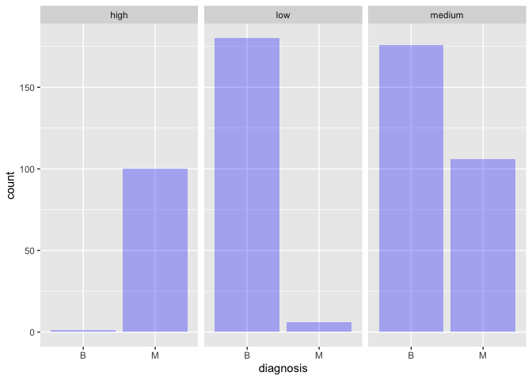
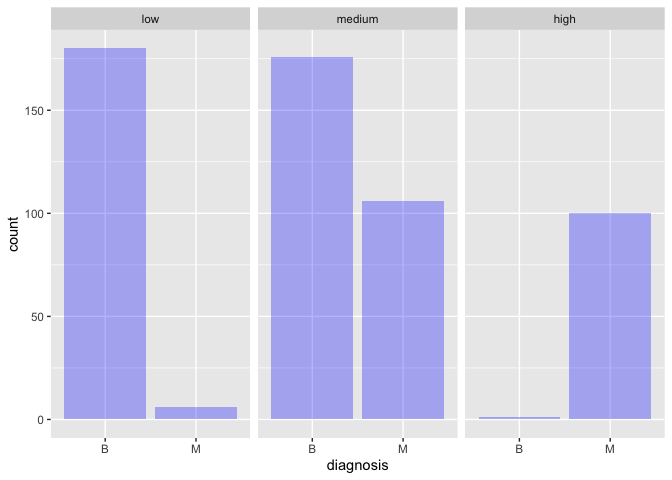
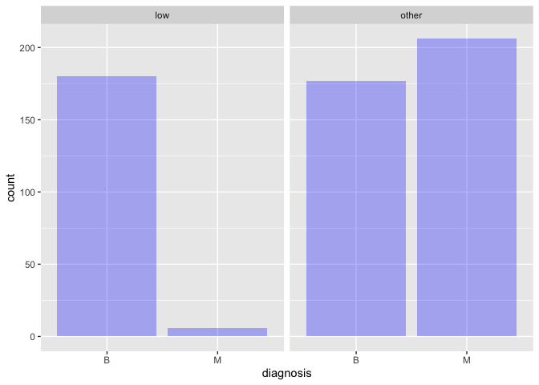

Mini Data-Analysis Deliverable 3
================
Armaghan Sarvar

# Welcome to the last milestone in the mini data analysis project!

In Milestone 1, I explored my chosen data and came up with research
questions. In Milestone 2, I obtained some results by making summary
tables and graphs.

In this (3rd) milestone, I will be sharpening some of the results
obtained from the previous milestone by:

-   Manipulating special data types in R: factors and/or dates and
    times.
-   Fitting a model object to the data, and extract a result.
-   Reading and writing data as separate files.

**NOTE**: It’s possible that we might find the instructions too rigid
for the data set. If this is the case, we may deviate from the
instructions – just should make sure we’re demonstrating a wide range of
tools and techniques taught in this class.

# Setup

Beginning by loading the `datateachr` and the `tidyverse` package below:

``` r
library(datateachr) # <- might contain the data you picked!
library(tidyverse)
library(broom)
```

From Milestone 2, I chose two final research questions to focus on,
which are the following:

1.  *Can we predict a diagnosis as malignant or benign based on the
    provided features from nuclei images?*
2.  *How is the distribution of each feature value considering the
    samples being malignant or benign?*

# Exercise 1: Special Data Types

For this exercise, we will be choosing two of the three tasks below.

But first, tasks 1 and 2 below ask you to modify a plot you made in a
previous milestone. The plot you choose should involve plotting across
at least three groups (whether by facetting, or using an aesthetic like
colour). Place this plot below (you’re allowed to modify the plot if
you’d like). If you don’t have such a plot, you’ll need to make one.
Place the code for the plot below.

``` r
cancer_sample
```

    ## # A tibble: 569 × 32
    ##          ID diagnosis radius_mean texture_mean perimeter_mean area_mean
    ##       <dbl> <chr>           <dbl>        <dbl>          <dbl>     <dbl>
    ##  1   842302 M                18.0         10.4          123.      1001 
    ##  2   842517 M                20.6         17.8          133.      1326 
    ##  3 84300903 M                19.7         21.2          130       1203 
    ##  4 84348301 M                11.4         20.4           77.6      386.
    ##  5 84358402 M                20.3         14.3          135.      1297 
    ##  6   843786 M                12.4         15.7           82.6      477.
    ##  7   844359 M                18.2         20.0          120.      1040 
    ##  8 84458202 M                13.7         20.8           90.2      578.
    ##  9   844981 M                13           21.8           87.5      520.
    ## 10 84501001 M                12.5         24.0           84.0      476.
    ## # … with 559 more rows, and 26 more variables: smoothness_mean <dbl>,
    ## #   compactness_mean <dbl>, concavity_mean <dbl>, concave_points_mean <dbl>,
    ## #   symmetry_mean <dbl>, fractal_dimension_mean <dbl>, radius_se <dbl>,
    ## #   texture_se <dbl>, perimeter_se <dbl>, area_se <dbl>, smoothness_se <dbl>,
    ## #   compactness_se <dbl>, concavity_se <dbl>, concave_points_se <dbl>,
    ## #   symmetry_se <dbl>, fractal_dimension_se <dbl>, radius_worst <dbl>,
    ## #   texture_worst <dbl>, perimeter_worst <dbl>, area_worst <dbl>, …

First, we extract the mean values of the feature `area_mean` for each of
the `diagnosis` categories and put them in a new feature called
`Mean_area_values`.

``` r
mean_values <- cancer_sample %>%
  group_by(diagnosis)%>%
  summarise(Mean_area_values = mean(area_mean)) %>%
  mutate(across(where(is.numeric)))
mean_values
```

    ## # A tibble: 2 × 2
    ##   diagnosis Mean_area_values
    ##   <chr>                <dbl>
    ## 1 B                     463.
    ## 2 M                     978.

Now that we have a range of the the mean values, here, we group the
numerical values of the `area_mean` column in the `cancer_sample`
dataset regarding the above calculation.

``` r
categorized <- cancer_sample %>%
     select(diagnosis, area_mean) %>%
     mutate(area = case_when (area_mean < 460 ~  "low", 
                              area_mean < 970 ~  "medium", 
                              TRUE ~ "high"))
categorized
```

    ## # A tibble: 569 × 3
    ##    diagnosis area_mean area  
    ##    <chr>         <dbl> <chr> 
    ##  1 M             1001  high  
    ##  2 M             1326  high  
    ##  3 M             1203  high  
    ##  4 M              386. low   
    ##  5 M             1297  high  
    ##  6 M              477. medium
    ##  7 M             1040  high  
    ##  8 M              578. medium
    ##  9 M              520. medium
    ## 10 M              476. medium
    ## # … with 559 more rows

Next, we can show a plot to visualize the number of samples in each of
the obtained categories.

``` r
final_plot <- ggplot(categorized, aes(diagnosis, ..count..)) +
   geom_bar(fill= "blue", alpha = 0.3) +
  facet_wrap(~area)
final_plot
```

<!-- -->  

Now, let’s choose two of the following tasks.

1.  Produce a new plot that reorders a factor in the original plot,
    using the `forcats` package (3 points). Then, in a sentence or two,
    briefly explain why you chose this ordering (1 point here for
    demonstrating understanding of the reordering, and 1 point for
    demonstrating some justification for the reordering, which could be
    subtle or speculative.)

2.  Produce a new plot that groups some factor levels together into an
    “other” category (or something similar), using the `forcats` package
    (3 points). Then, in a sentence or two, briefly explain why you
    chose this grouping (1 point here for demonstrating understanding of
    the grouping, and 1 point for demonstrating some justification for
    the grouping, which could be subtle or speculative.)

3.  If the data has some sort of time-based column like a date (but
    something more granular than just a year):

    1.  Make a new column that uses a function from the `lubridate` or
        `tsibble` package to modify the original time-based column. (3
        points)
        -   Note that you might first have to *make* a time-based column
            using a function like `ymd()`, but this doesn’t count.
        -   Examples of something you might do here: extract the day of
            the year from a date, or extract the weekday, or let 24
            hours elapse on the dates.
    2.  Then, in a sentence or two, explain how the new column might be
        useful in exploring a research question. (1 point for
        demonstrating understanding of the function you used, and 1
        point for the justification, which could be subtle or
        speculative).
        -   For example, you could say something like “Investigating the
            day of the week might be insightful because penguins don’t
            work on weekends, and so may respond differently”.

**Task Number**: 1

``` r
Task1_plot <- categorized %>%
  mutate(area=fct_relevel(area, "low", "medium", "high")) %>%
  ggplot(aes(diagnosis, ..count..)) +
  geom_bar(fill= "blue", alpha = 0.3) +
  facet_wrap(~area)
Task1_plot
```

<!-- -->

  
As seen in the previous (initial) plot, the factors appeared
alphabetically. Here, we change this so that they appear in ascending
area_mean order using the `fct_relevel` function. This allows for an
easier and more intuitive comparison based on this feature as now the
plot cases are the mean of `area_mean` values in ascending order, for
each diagnosis category.

**Task Number**: 2

``` r
Task1_plot <- categorized %>%
  mutate(area=fct_relevel(area, "low", "medium", "high")) %>%
  mutate(area = fct_collapse(area, other = c("medium", "high"))) %>%
  ggplot(aes(diagnosis, ..count..)) +
  geom_bar(fill= "blue", alpha = 0.3) +
  facet_wrap(~area)
Task1_plot
```

<!-- -->  

In the above plot, the two “medium” and “high” categories of the area
column extracted before are considered as an independent group, and the
“low” category has been demonstrated separately. This is helpful if we
want to compare the “low” values with all other possible numbers of the
`area-mean` features, and see how many benign and malignant samples are
present for “low” area_mean vs. other area_mean values. In future
analysis where the goal is to predict the diagnosis based on tumor
features, this kind of plot is highly helpful when one needs to
concentrate on specific data sample values and look at them separately
to find the relationship of those samples with the final category. *Most
importantly, this separation aggregates almost all the Malignant data
into a single group (“other”).*

# Exercise 2: Modelling

## 2.0

Here, we pick a research question, and pick a variable of interest
(we’ll call it “Y”) that’s relevant to the research question. Indicate
these.

**Research Question**: Can we predict a diagnosis as malignant or benign
based on the provided features from nuclei images?

**Variable of interest**: diagnosis

## 2.1

Fit a model or run a hypothesis test that provides insight on this
variable with respect to the research question. Store the model object
as a variable, and print its output to screen. We’ll omit having to
justify the choice, because we don’t expect you to know about model
specifics in STAT 545.

-   **Note**: It’s OK if you don’t know how these models/tests work.
    Here are some examples of things you can do here, but the sky’s the
    limit.
    -   You could fit a model that makes predictions on Y using another
        variable, by using the `lm()` function.
    -   You could test whether the mean of Y equals 0 using `t.test()`,
        or maybe the mean across two groups are different using
        `t.test()`, or maybe the mean across multiple groups are
        different using `anova()` (you may have to pivot the data for
        the latter two).
    -   You could use `lm()` to test for significance of regression.

It should be noted that the `lm` function needs numeric `Y` values to
fit a model with. However, the values of the `diagnosis` column are
categorical. Hence, we use the following code which converts these
categorical values to 0 and 1, so that the model is fit successfully.

``` r
categorical_diagnosis <- as.numeric(factor(as.matrix(cancer_sample[, "diagnosis"]))) - 1
new_df <- cancer_sample
new_df[, "diagnosis"] <- categorical_diagnosis
new_df
```

    ## # A tibble: 569 × 32
    ##          ID diagnosis radius_mean texture_mean perimeter_mean area_mean
    ##       <dbl>     <dbl>       <dbl>        <dbl>          <dbl>     <dbl>
    ##  1   842302         1        18.0         10.4          123.      1001 
    ##  2   842517         1        20.6         17.8          133.      1326 
    ##  3 84300903         1        19.7         21.2          130       1203 
    ##  4 84348301         1        11.4         20.4           77.6      386.
    ##  5 84358402         1        20.3         14.3          135.      1297 
    ##  6   843786         1        12.4         15.7           82.6      477.
    ##  7   844359         1        18.2         20.0          120.      1040 
    ##  8 84458202         1        13.7         20.8           90.2      578.
    ##  9   844981         1        13           21.8           87.5      520.
    ## 10 84501001         1        12.5         24.0           84.0      476.
    ## # … with 559 more rows, and 26 more variables: smoothness_mean <dbl>,
    ## #   compactness_mean <dbl>, concavity_mean <dbl>, concave_points_mean <dbl>,
    ## #   symmetry_mean <dbl>, fractal_dimension_mean <dbl>, radius_se <dbl>,
    ## #   texture_se <dbl>, perimeter_se <dbl>, area_se <dbl>, smoothness_se <dbl>,
    ## #   compactness_se <dbl>, concavity_se <dbl>, concave_points_se <dbl>,
    ## #   symmetry_se <dbl>, fractal_dimension_se <dbl>, radius_worst <dbl>,
    ## #   texture_worst <dbl>, perimeter_worst <dbl>, area_worst <dbl>, …

Also, the `ID` column does not have anything to do with the
characteristics of the tumor! So, we drop this column.

``` r
cancer_sample_final <- (select(new_df, -c(ID)))
cancer_sample_final
```

    ## # A tibble: 569 × 31
    ##    diagnosis radius_mean texture_mean perimeter_mean area_mean smoothness_mean
    ##        <dbl>       <dbl>        <dbl>          <dbl>     <dbl>           <dbl>
    ##  1         1        18.0         10.4          123.      1001           0.118 
    ##  2         1        20.6         17.8          133.      1326           0.0847
    ##  3         1        19.7         21.2          130       1203           0.110 
    ##  4         1        11.4         20.4           77.6      386.          0.142 
    ##  5         1        20.3         14.3          135.      1297           0.100 
    ##  6         1        12.4         15.7           82.6      477.          0.128 
    ##  7         1        18.2         20.0          120.      1040           0.0946
    ##  8         1        13.7         20.8           90.2      578.          0.119 
    ##  9         1        13           21.8           87.5      520.          0.127 
    ## 10         1        12.5         24.0           84.0      476.          0.119 
    ## # … with 559 more rows, and 25 more variables: compactness_mean <dbl>,
    ## #   concavity_mean <dbl>, concave_points_mean <dbl>, symmetry_mean <dbl>,
    ## #   fractal_dimension_mean <dbl>, radius_se <dbl>, texture_se <dbl>,
    ## #   perimeter_se <dbl>, area_se <dbl>, smoothness_se <dbl>,
    ## #   compactness_se <dbl>, concavity_se <dbl>, concave_points_se <dbl>,
    ## #   symmetry_se <dbl>, fractal_dimension_se <dbl>, radius_worst <dbl>,
    ## #   texture_worst <dbl>, perimeter_worst <dbl>, area_worst <dbl>, …

The following code fits the final linear model on the dataset that we
created. The features consist of all columns except the `diagnosis` and
`ID` columns.

``` r
fitted_model <- lm(diagnosis ~ ., data = cancer_sample_final)
fitted_model
```

    ## 
    ## Call:
    ## lm(formula = diagnosis ~ ., data = cancer_sample_final)
    ## 
    ## Coefficients:
    ##             (Intercept)              radius_mean             texture_mean  
    ##              -2.0218117               -0.2177721                0.0045455  
    ##          perimeter_mean                area_mean          smoothness_mean  
    ##               0.0237399                0.0003178                0.0846891  
    ##        compactness_mean           concavity_mean      concave_points_mean  
    ##              -4.2220353                1.3979973                2.1418330  
    ##           symmetry_mean   fractal_dimension_mean                radius_se  
    ##               0.1027092                0.0332616                0.4349559  
    ##              texture_se             perimeter_se                  area_se  
    ##              -0.0067585               -0.0225203               -0.0009232  
    ##           smoothness_se           compactness_se             concavity_se  
    ##              15.8543207                0.0649034               -3.5654680  
    ##       concave_points_se              symmetry_se     fractal_dimension_se  
    ##              10.5679513                1.6973407               -7.1464402  
    ##            radius_worst            texture_worst          perimeter_worst  
    ##               0.1951831                0.0071594               -0.0024351  
    ##              area_worst         smoothness_worst        compactness_worst  
    ##              -0.0010112                0.5428569                0.0671583  
    ##         concavity_worst     concave_points_worst           symmetry_worst  
    ##               0.3811912                0.4643099                0.5567875  
    ## fractal_dimension_worst  
    ##               4.3034831

We will also test the result for normalized dataset, as it was generated
in the previous milestone.

``` r
cancer_sample_final2 <- cancer_sample_final %>% mutate_at(2:30, funs((.-min(.))/max(.-min(.))))
```

    ## Warning: `funs()` was deprecated in dplyr 0.8.0.
    ## Please use a list of either functions or lambdas: 
    ## 
    ##   # Simple named list: 
    ##   list(mean = mean, median = median)
    ## 
    ##   # Auto named with `tibble::lst()`: 
    ##   tibble::lst(mean, median)
    ## 
    ##   # Using lambdas
    ##   list(~ mean(., trim = .2), ~ median(., na.rm = TRUE))
    ## This warning is displayed once every 8 hours.
    ## Call `lifecycle::last_lifecycle_warnings()` to see where this warning was generated.

``` r
cancer_sample_final2
```

    ## # A tibble: 569 × 31
    ##    diagnosis radius_mean texture_mean perimeter_mean area_mean smoothness_mean
    ##        <dbl>       <dbl>        <dbl>          <dbl>     <dbl>           <dbl>
    ##  1         1       0.521       0.0227          0.546     0.364           0.594
    ##  2         1       0.643       0.273           0.616     0.502           0.290
    ##  3         1       0.601       0.390           0.596     0.449           0.514
    ##  4         1       0.210       0.361           0.234     0.103           0.811
    ##  5         1       0.630       0.157           0.631     0.489           0.430
    ##  6         1       0.259       0.203           0.268     0.142           0.679
    ##  7         1       0.533       0.347           0.524     0.380           0.379
    ##  8         1       0.318       0.376           0.321     0.184           0.598
    ##  9         1       0.285       0.410           0.302     0.160           0.674
    ## 10         1       0.259       0.485           0.278     0.141           0.596
    ## # … with 559 more rows, and 25 more variables: compactness_mean <dbl>,
    ## #   concavity_mean <dbl>, concave_points_mean <dbl>, symmetry_mean <dbl>,
    ## #   fractal_dimension_mean <dbl>, radius_se <dbl>, texture_se <dbl>,
    ## #   perimeter_se <dbl>, area_se <dbl>, smoothness_se <dbl>,
    ## #   compactness_se <dbl>, concavity_se <dbl>, concave_points_se <dbl>,
    ## #   symmetry_se <dbl>, fractal_dimension_se <dbl>, radius_worst <dbl>,
    ## #   texture_worst <dbl>, perimeter_worst <dbl>, area_worst <dbl>, …

``` r
fitted_model2 <- lm(diagnosis ~ ., data = cancer_sample_final2)
fitted_model2
```

    ## 
    ## Call:
    ## lm(formula = diagnosis ~ ., data = cancer_sample_final2)
    ## 
    ## Coefficients:
    ##             (Intercept)              radius_mean             texture_mean  
    ##               -0.969124                -4.601306                 0.134410  
    ##          perimeter_mean                area_mean          smoothness_mean  
    ##                3.435395                 0.749295                 0.009381  
    ##        compactness_mean           concavity_mean      concave_points_mean  
    ##               -1.376468                 0.596665                 0.430937  
    ##           symmetry_mean   fractal_dimension_mean                radius_se  
    ##                0.020336                 0.001579                 1.201131  
    ##              texture_se             perimeter_se                  area_se  
    ##               -0.030581                -0.477947                -0.494289  
    ##           smoothness_se           compactness_se             concavity_se  
    ##                0.466387                 0.008642                -1.411925  
    ##       concave_points_se              symmetry_se     fractal_dimension_se  
    ##                0.557882                 0.120627                -0.206855  
    ##            radius_worst            texture_worst          perimeter_worst  
    ##                5.486598                 0.268620                -0.488934  
    ##              area_worst         smoothness_worst        compactness_worst  
    ##               -4.114465                 0.082205                 0.069221  
    ##         concavity_worst     concave_points_worst           symmetry_worst  
    ##                0.477251                 0.135114                 0.282458  
    ## fractal_dimension_worst  
    ##                4.303483

## 2.2

Produce something relevant from my fitted model: either predictions on
Y, or a single value like a regression coefficient or a p-value.

-   Be sure to indicate in writing what you chose to produce.
-   Our code should either output a tibble (in which case you should
    indicate the column that contains the thing you’re looking for), or
    the thing you’re looking for itself.
-   Obtain our results using the `broom` package if possible. If the
    model is not compatible with the broom function you’re needing, then
    you can obtain the results by some other means, but first indicate
    which broom function is not compatible.

Using the `glance` function from the broom package for better
apprehension of the model:

``` r
glance(fitted_model)
```

    ## # A tibble: 1 × 12
    ##   r.squared adj.r.squared sigma statistic   p.value    df logLik   AIC   BIC
    ##       <dbl>         <dbl> <dbl>     <dbl>     <dbl> <dbl>  <dbl> <dbl> <dbl>
    ## 1     0.774         0.762 0.236      61.5 6.05e-153    30   29.7  4.70  144.
    ## # … with 3 more variables: deviance <dbl>, df.residual <int>, nobs <int>

``` r
glance(fitted_model2)
```

    ## # A tibble: 1 × 12
    ##   r.squared adj.r.squared sigma statistic   p.value    df logLik   AIC   BIC
    ##       <dbl>         <dbl> <dbl>     <dbl>     <dbl> <dbl>  <dbl> <dbl> <dbl>
    ## 1     0.774         0.762 0.236      61.5 6.05e-153    30   29.7  4.70  144.
    ## # … with 3 more variables: deviance <dbl>, df.residual <int>, nobs <int>

With the above code, we can see a tibble that contains the summary of
p-values for hypothesis tests, the goodness of fit measures, and other
useful information regarding our model which help us validate it. As
seen, the `glance` function returns a one-row tibble.

Using the `augment` function from the broom package to add columns to
the original data that was modeled.

``` r
augment(fitted_model)
```

    ## # A tibble: 569 × 37
    ##    diagnosis radius_mean texture_mean perimeter_mean area_mean smoothness_mean
    ##        <dbl>       <dbl>        <dbl>          <dbl>     <dbl>           <dbl>
    ##  1         1        18.0         10.4          123.      1001           0.118 
    ##  2         1        20.6         17.8          133.      1326           0.0847
    ##  3         1        19.7         21.2          130       1203           0.110 
    ##  4         1        11.4         20.4           77.6      386.          0.142 
    ##  5         1        20.3         14.3          135.      1297           0.100 
    ##  6         1        12.4         15.7           82.6      477.          0.128 
    ##  7         1        18.2         20.0          120.      1040           0.0946
    ##  8         1        13.7         20.8           90.2      578.          0.119 
    ##  9         1        13           21.8           87.5      520.          0.127 
    ## 10         1        12.5         24.0           84.0      476.          0.119 
    ## # … with 559 more rows, and 31 more variables: compactness_mean <dbl>,
    ## #   concavity_mean <dbl>, concave_points_mean <dbl>, symmetry_mean <dbl>,
    ## #   fractal_dimension_mean <dbl>, radius_se <dbl>, texture_se <dbl>,
    ## #   perimeter_se <dbl>, area_se <dbl>, smoothness_se <dbl>,
    ## #   compactness_se <dbl>, concavity_se <dbl>, concave_points_se <dbl>,
    ## #   symmetry_se <dbl>, fractal_dimension_se <dbl>, radius_worst <dbl>,
    ## #   texture_worst <dbl>, perimeter_worst <dbl>, area_worst <dbl>, …

``` r
augment(fitted_model2)
```

    ## # A tibble: 569 × 37
    ##    diagnosis radius_mean texture_mean perimeter_mean area_mean smoothness_mean
    ##        <dbl>       <dbl>        <dbl>          <dbl>     <dbl>           <dbl>
    ##  1         1       0.521       0.0227          0.546     0.364           0.594
    ##  2         1       0.643       0.273           0.616     0.502           0.290
    ##  3         1       0.601       0.390           0.596     0.449           0.514
    ##  4         1       0.210       0.361           0.234     0.103           0.811
    ##  5         1       0.630       0.157           0.631     0.489           0.430
    ##  6         1       0.259       0.203           0.268     0.142           0.679
    ##  7         1       0.533       0.347           0.524     0.380           0.379
    ##  8         1       0.318       0.376           0.321     0.184           0.598
    ##  9         1       0.285       0.410           0.302     0.160           0.674
    ## 10         1       0.259       0.485           0.278     0.141           0.596
    ## # … with 559 more rows, and 31 more variables: compactness_mean <dbl>,
    ## #   concavity_mean <dbl>, concave_points_mean <dbl>, symmetry_mean <dbl>,
    ## #   fractal_dimension_mean <dbl>, radius_se <dbl>, texture_se <dbl>,
    ## #   perimeter_se <dbl>, area_se <dbl>, smoothness_se <dbl>,
    ## #   compactness_se <dbl>, concavity_se <dbl>, concave_points_se <dbl>,
    ## #   symmetry_se <dbl>, fractal_dimension_se <dbl>, radius_worst <dbl>,
    ## #   texture_worst <dbl>, perimeter_worst <dbl>, area_worst <dbl>, …

With the above code, we can add columns such as the predictions of the
dependent variable using the model (`.fitted` column), residuals
(`.resid` column), and cluster assignments to the original data.

Using the `tidy` function from the broom package to construct a tibble
that summarizes the model’s statistical findings.

``` r
tidy(fitted_model)
```

    ## # A tibble: 31 × 5
    ##    term                 estimate std.error statistic    p.value
    ##    <chr>                   <dbl>     <dbl>     <dbl>      <dbl>
    ##  1 (Intercept)         -2.02      0.428      -4.72   0.00000296
    ##  2 radius_mean         -0.218     0.174      -1.26   0.210     
    ##  3 texture_mean         0.00455   0.00794     0.572  0.567     
    ##  4 perimeter_mean       0.0237    0.0251      0.946  0.345     
    ##  5 area_mean            0.000318  0.000525    0.605  0.545     
    ##  6 smoothness_mean      0.0847    2.02        0.0420 0.967     
    ##  7 compactness_mean    -4.22      1.33       -3.17   0.00163   
    ##  8 concavity_mean       1.40      1.05        1.34   0.182     
    ##  9 concave_points_mean  2.14      1.98        1.08   0.280     
    ## 10 symmetry_mean        0.103     0.743       0.138  0.890     
    ## # … with 21 more rows

``` r
tidy(fitted_model2)
```

    ## # A tibble: 31 × 5
    ##    term                estimate std.error statistic       p.value
    ##    <chr>                  <dbl>     <dbl>     <dbl>         <dbl>
    ##  1 (Intercept)         -0.969       0.164   -5.90   0.00000000643
    ##  2 radius_mean         -4.60        3.67    -1.26   0.210        
    ##  3 texture_mean         0.134       0.235    0.572  0.567        
    ##  4 perimeter_mean       3.44        3.63     0.946  0.345        
    ##  5 area_mean            0.749       1.24     0.605  0.545        
    ##  6 smoothness_mean      0.00938     0.223    0.0420 0.967        
    ##  7 compactness_mean    -1.38        0.435   -3.17   0.00163      
    ##  8 concavity_mean       0.597       0.446    1.34   0.182        
    ##  9 concave_points_mean  0.431       0.398    1.08   0.280        
    ## 10 symmetry_mean        0.0203      0.147    0.138  0.890        
    ## # … with 21 more rows

With the above code, we can have coefficients and p-values for each term
in a regression, per-cluster information in clustering applications, or
per-test information for multtest functions. As seen, the output of the
`tidy` and `augment` functions is also a tibble.

# Exercise 3: Reading and writing data

Get set up for this exercise by making a folder called `output` in the
top level of the project folder / repository. You’ll be saving things
there.

## 3.1 (5 points)

Take a summary table that you made from Milestone 2 (Exercise 1.2), and
write it as a csv file in the `output` folder. Use the `here::here()`
function.

-   **Robustness criteria**: We should be able to move the Mini Project
    repository / project folder to some other location on the computer,
    or move this very Rmd file to another location within the project
    repository / folder, and the code should still work.
-   **Reproducibility criteria**: You should be able to delete the csv
    file, and remake it simply by knitting this Rmd file.

Taking a summary table: **Computing the range, mean, standard deviation
and median of the “concavity_mean” variable across the groups of the
“diagnosis” variable from the data.**

``` r
summ_table <- (cancer_sample %>%
  group_by(diagnosis) %>%
  summarize(range(concavity_mean)[1], range(concavity_mean)[2], mean(concavity_mean), median(concavity_mean), sd(concavity_mean)))
summ_table
```

    ## # A tibble: 2 × 6
    ##   diagnosis `range(concavity… `range(concavit… `mean(concavity… `median(concavi…
    ##   <chr>                 <dbl>            <dbl>            <dbl>            <dbl>
    ## 1 B                    0                 0.411           0.0461           0.0371
    ## 2 M                    0.0240            0.427           0.161            0.151 
    ## # … with 1 more variable: sd(concavity_mean) <dbl>

``` r
dir.create(here::here("output"))
```

    ## Warning in dir.create(here::here("output")): '/Users/armaghansarvar/Documents/
    ## Master's/Stat/Group-project/mda-ArmaghanSarvar/output' already exists

## Save the table to .csv file

``` r
write_csv(summ_table, here::here("output", "summ_table.csv"))
```

## 3.2 (5 points)

Write the model object from Exercise 2 to an R binary file (an RDS), and
load it again. Be sure to save the binary file in the `output` folder.
Use the functions `saveRDS()` and `readRDS()`.

-   The same robustness and reproducibility criteria as in 3.1 apply
    here.

## Save the fitted model

``` r
saveRDS(object = fitted_model, here::here("output", "fitted_model.rds"))
```

## Load the fitted model

``` r
model_reloaded = readRDS(here::here("output", "fitted_model.rds"))
```

## Check if it was reloaded correctly

``` r
model_reloaded %>% 
  tidy() %>% 
  knitr::kable(format = "markdown") 
```

| term                    |   estimate |  std.error |  statistic |   p.value |
|:------------------------|-----------:|-----------:|-----------:|----------:|
| (Intercept)             | -2.0218117 |  0.4280072 | -4.7237797 | 0.0000030 |
| radius_mean             | -0.2177721 |  0.1735089 | -1.2551061 | 0.2099852 |
| texture_mean            |  0.0045455 |  0.0079439 |  0.5721987 | 0.5674264 |
| perimeter_mean          |  0.0237399 |  0.0250985 |  0.9458675 | 0.3446408 |
| area_mean               |  0.0003178 |  0.0005253 |  0.6050643 | 0.5453914 |
| smoothness_mean         |  0.0846891 |  2.0172759 |  0.0419819 | 0.9665287 |
| compactness_mean        | -4.2220353 |  1.3336803 | -3.1657028 | 0.0016347 |
| concavity_mean          |  1.3979973 |  1.0458611 |  1.3366950 | 0.1818872 |
| concave_points_mean     |  2.1418330 |  1.9791819 |  1.0821810 | 0.2796569 |
| symmetry_mean           |  0.1027092 |  0.7427382 |  0.1382845 | 0.8900673 |
| fractal_dimension_mean  |  0.0332616 |  5.5722693 |  0.0059691 | 0.9952396 |
| radius_se               |  0.4349559 |  0.3104682 |  1.4009679 | 0.1618002 |
| texture_se              | -0.0067585 |  0.0368439 | -0.1834355 | 0.8545254 |
| perimeter_se            | -0.0225203 |  0.0411183 | -0.5476948 | 0.5841286 |
| area_se                 | -0.0009232 |  0.0013978 | -0.6604700 | 0.5092349 |
| smoothness_se           | 15.8543207 |  6.6248737 |  2.3931506 | 0.0170462 |
| compactness_se          |  0.0649034 |  2.1694829 |  0.0299165 | 0.9761447 |
| concavity_se            | -3.5654680 |  1.3007522 | -2.7410816 | 0.0063274 |
| concave_points_se       | 10.5679513 |  5.4520354 |  1.9383497 | 0.0531033 |
| symmetry_se             |  1.6973407 |  2.7276006 |  0.6222834 | 0.5340191 |
| fractal_dimension_se    | -7.1464402 | 11.6764096 | -0.6120409 | 0.5407693 |
| radius_worst            |  0.1951831 |  0.0579677 |  3.3670993 | 0.0008140 |
| texture_worst           |  0.0071594 |  0.0069489 |  1.0302857 | 0.3033389 |
| perimeter_worst         | -0.0024351 |  0.0059360 | -0.4102206 | 0.6818075 |
| area_worst              | -0.0010112 |  0.0003197 | -3.1633786 | 0.0016476 |
| smoothness_worst        |  0.5428569 |  1.4346393 |  0.3783926 | 0.7052882 |
| compactness_worst       |  0.0671583 |  0.3830830 |  0.1753101 | 0.8609020 |
| concavity_worst         |  0.3811912 |  0.2686173 |  1.4190864 | 0.1564529 |
| concave_points_worst    |  0.4643099 |  0.9142253 |  0.5078725 | 0.6117509 |
| symmetry_worst          |  0.5567875 |  0.4943014 |  1.1264132 | 0.2604929 |
| fractal_dimension_worst |  4.3034831 |  2.3832134 |  1.8057481 | 0.0715165 |

# Tidy Repository

Now that this is the last milestone, our entire project repository
should be organized. Here are the criteria we’re looking for.

## Main README (3 points)

There should be a file named `README.md` at the top level of the
repository. Its contents should automatically appear when you visit the
repository on GitHub.

Minimum contents of the README file:

-   In a sentence or two, explains what this repository is, so that
    future-you or someone else stumbling on the repository can be
    oriented to the repository.
-   In a sentence or two (or more??), briefly explains how to engage
    with the repository. You can assume the person reading knows the
    material from STAT 545A. Basically, if a visitor to the repository
    wants to explore the project, what should they know?

Once you get in the habit of making README files, and seeing more README
files in other projects, you’ll wonder how you ever got by without them!
They are tremendously helpful.

## File and Folder structure (3 points)

You should have at least four folders in the top level of the
repository: one for each milestone, and one output folder. If there are
any other folders, these are explained in the main README.

Each milestone document is contained in its respective folder, and
nowhere else.

Every level-1 folder (that is, the ones stored in the top level, like
“Milestone1” and “output”) has a `README` file, explaining in a sentence
or two what is in the folder, in plain language (it’s enough to say
something like “This folder contains the source for Milestone 1”).

## Output (2 points)

All output is recent and relevant:

-   All Rmd files have been `knit`ted to their output, and all data
    files saved from Exercise 3 above appear in the `output` folder.
-   All of these output files are up-to-date – that is, they haven’t
    fallen behind after the source (Rmd) files have been updated.
-   There should be no relic output files. For example, if you were
    knitting an Rmd to html, but then changed the output to be only a
    markdown file, then the html file is a relic and should be deleted.

Our recommendation: delete all output files, and re-knit each
milestone’s Rmd file, so that everything is up to date and relevant.

PS: there’s a way where you can run all project code using a single
command, instead of clicking “knit” three times. More on this in STAT
545B!

## Error-free code (1 point)

This Milestone 3 document knits error-free. (We’ve already graded this
aspect for Milestone 1 and 2)

## Tagged release (1 point)

You’ve tagged a release for Milestone 3. (We’ve already graded this
aspect for Milestone 1 and 2)
